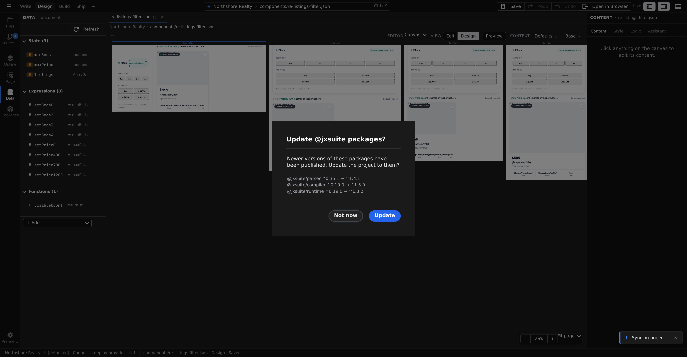

# State

> **Studio writes this format for you.** Every entry you create in the [Data panel](/docs/studio/logic/data), whether a value, a computed entry, a data source or a function, is saved as one of the shapes on this page.

`state` is the root-level object holding everything a document knows at runtime: mutable values, derived values, functions, and data sources. Every entry is reactive by default: change a value and everything bound to it updates. The **shape** of each entry determines what it is; no extra flags are needed in the common case.

```json
{
  "tagName": "my-counter",
  "state": { "count": 0 },
  "children": [{ "tagName": "span", "textContent": "${state.count}" }]
}
```



## Shape 1: naked values

A JSON scalar, array, or plain object with no reserved keys is a mutable reactive value, initialized to exactly what you wrote:

```json
{
  "state": {
    "count": 0,
    "price": 9.99,
    "name": "World",
    "active": false,
    "data": null,
    "tags": [],
    "user": { "id": null, "name": "", "role": "guest" }
  }
}
```

A plain string counts as a naked value only when it contains no `${}`; otherwise it is Shape 3.

## Shape 2: typed values

An object with a `default` property (and no `$prototype`) is a typed value. `default` supplies the initial value; `type` references a JSON Schema, either inline or via `$ref` to `$defs`:

```json
{
  "state": {
    "count": {
      "type": { "$ref": "#/$defs/Count" },
      "default": 0,
      "description": "Current counter value"
    }
  }
}
```

Schema keywords are tooling-only. They drive validation, autocomplete, and which Studio control edits the entry, then are stripped before runtime. The `format` keyword picks a specialized Studio input without changing the runtime value:

```json
{
  "state": {
    "bg": { "type": "string", "format": "image", "default": "" },
    "publishDate": { "type": "string", "format": "date", "default": "" },
    "accentColor": { "type": "string", "format": "color", "default": "#000000" }
  }
}
```

Use the typed form when the value needs constraints, documentation, or a shared type; use naked values when none apply.

## Shape 3: computed templates

A string containing `${}` is a **computed** value, recalculated automatically whenever the state it reads changes:

```json
{
  "state": {
    "fullName": "${state.firstName} ${state.lastName}",
    "displayTitle": "${state.score >= 90 ? 'Expert' : 'Beginner'}",
    "scoreLabel": "${state.score}%",
    "isEmpty": "${state.items.length === 0}"
  }
}
```

The text inside `${}` is a pure expression over `state`: no statements, no assignments, no `return`. For computed values built without expression syntax at all, see [Expressions](/docs/framework/concepts/expressions).

## Shape 4: prototypes

An object with `$prototype` declares a function or a data source. Functions use `$prototype: "Function"` with an inline `body` or an external `$src` (see [Functions](/docs/framework/concepts/functions)); any other constructor name declares a data source (see [Data prototypes](/docs/framework/concepts/data-prototypes)):

```json
{
  "state": {
    "increment": { "$prototype": "Function", "body": "state.count++" },
    "userData": {
      "$prototype": "Request",
      "url": "/api/users/",
      "method": "GET"
    }
  }
}
```

Data-source entries always resolve reactively. An object with `$expression` is the fifth, fully declarative shape: a computed value or handler built from structure instead of a code string ([Expressions](/docs/framework/concepts/expressions)).

## Private entries

A `#` prefix marks an entry as private, meaning internal workings that are never exposed to the Studio property panel, never included in tooling exports, and never settable via `$props`:

```json
{
  "state": {
    "count": 0,
    "#cache": {},
    "#lastFetchTime": null
  }
}
```

Private is enforced, not just conventional. A parent that names one in `$props`, or passes it as a `props.#cache` attribute or a JS property, has the write **ignored**, with a console warning naming the entry. The instance still renders: a private key in `$props` is a mistake worth pointing at, not a reason to blank the component. The custom element also gets no `#cache` property, so there is no back door around the check.

Rename the entry without the `#` if you meant it to be part of the component's interface.

## How it works

At load time the runtime walks `state` once, classifying each entry by inspection in a fixed order: a string containing `${` is computed; any other scalar or array is a naked value; an object is checked for `$expression`, then `$prototype`, then `default`; a plain object with no reserved keys is a naked object value. The whole scope is initialized inside a reactive proxy, computed templates become tracked computed values, and inside function bodies state is read and written directly (`state.count`, `state.items.push(...)`), with no getter or setter calls.

## Rules

- Every entry is reactive by default; there is no opt-in flag.
- Shape follows from inspection alone: a string with `${}` is _always_ computed, an object with `default` and no `$prototype` is _always_ a typed value.
- Computed templates must be pure expressions: no statements, no assignments, no semicolons, no `return`.
- `state` inside a template refers only to the current document's scope, never a parent's.
- Entry names are `camelCase` (`count`, `firstName`, `handleInput`); types in `$defs` are `PascalCase` (`TodoItem`).
- `#`-prefixed entries are private: hidden from props and tooling exports.
- On a Function entry, `body` and `$src` are mutually exclusive.

## Related

- [Reactivity](/docs/framework/concepts/reactivity): how `${}` bindings track dependencies
- [Expressions](/docs/framework/concepts/expressions): the declarative Shape 5
- [Functions](/docs/framework/concepts/functions): Function entries, sidecars, and statements
- [Data prototypes](/docs/framework/concepts/data-prototypes): Request, LocalStorage, collections
- [Data panel](/docs/studio/logic/data): the Studio surface that writes these entries
