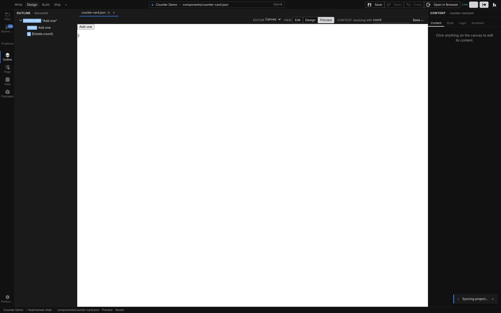
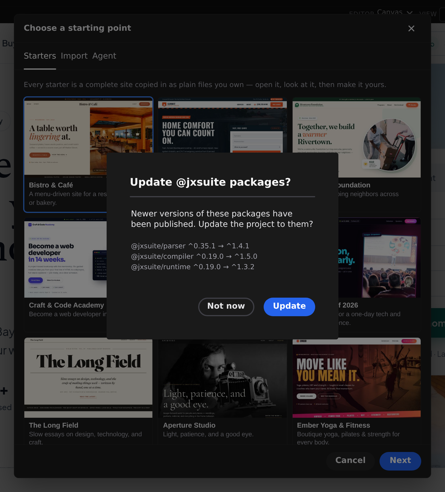
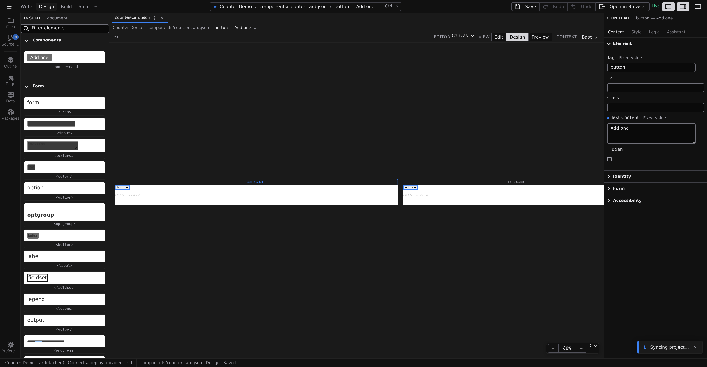
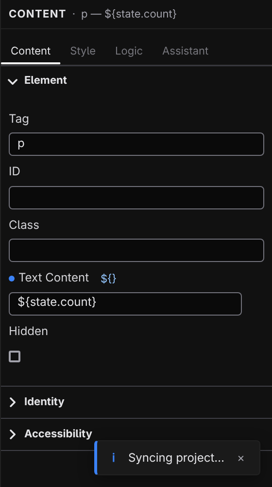
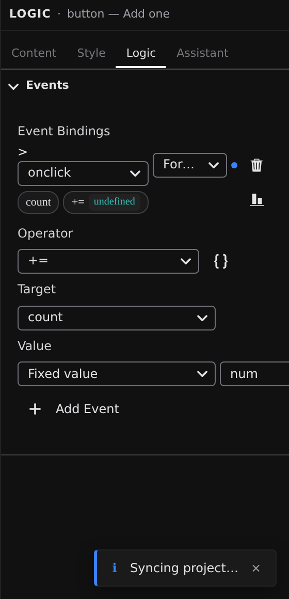
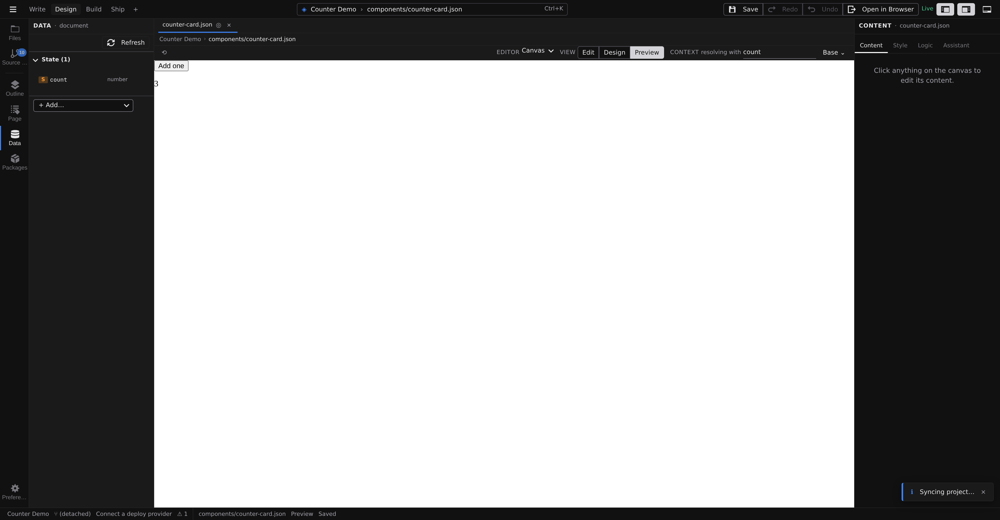
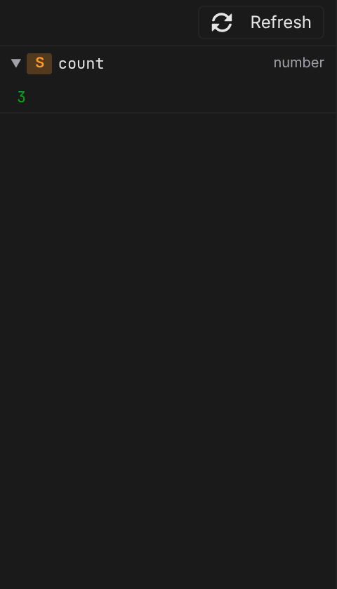
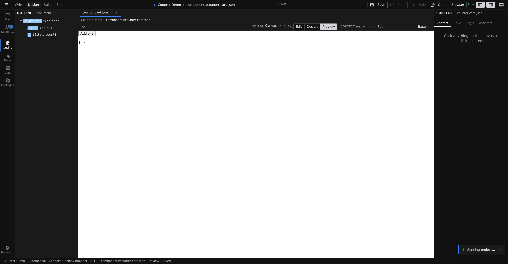

# Tutorial: your first interactive component

In this tutorial you build a `counter-card` component: a button and a line of text that counts the clicks, live. Small as it is, it walks the whole loop every interactive piece of a Jx site is made from — elements on the canvas, a state value, a binding, and an event — without writing any code.

**About 15 minutes.** Before you start:

- Have Jx Studio running — see **[Install Jx Studio](/docs/start/install)**.
- If Studio is completely new to you, skim **[Your first project](/docs/start/first-project)** first — this tutorial starts where it ends, with a project open.

## 1. Open a project

Any project works. If you already have one from [Your first project](/docs/start/first-project), open it with **Open Project**. Otherwise choose **New Project…**, scroll to the **Start from scratch** card at the end of the starter gallery, click **Next**, name the project (say, "Counter Demo"), and click **Create Project**. Every step of the wizard is explained in **[Create a project](/docs/studio/projects/create)**.

You should now see your project open on the canvas.

## 2. Create the component

1. Press :kbd[⌘⇧E] to open **The Library**.
2. Click **New** and choose **Component**.
3. Type `counter-card` and confirm.

Studio writes `components/counter-card.json` and opens it in a new tab — an empty canvas, ready to fill. (When to reach for a component versus a page or layout is covered in **[Pages, layouts, and components](/docs/studio/projects/pages-layouts-components)**.)

## 3. Switch to Design

Component files open in **Edit**. In the **View** control on the pane's context bar, click **Design**.

The canvas now shows your component once per breakpoint — empty for the moment — and the Inspector on the right offers the **Content**, **Style**, **Logic**, and **Assistant** tabs. Views are just lenses on the same file; see **[Modes and views](/docs/studio/interface/modes)**.

## 4. Add a button and a text line

1. Press :kbd[⌘K] and run **Show Insert** to open the palette.
2. With nothing selected, click the `<button>` card. The button is added to the empty component.
3. Click the `
` card to add a paragraph. A card inserts into whatever is selected, as its last child; with nothing selected that's the component's root, so the paragraph lands after the button rather than inside it.
4. Select the button, open the Inspector's **Content** tab, and type `Add one` into **Text Content**.

You should now see a button labeled **Add one** with an empty paragraph after it, at every breakpoint. The other ways to insert — dragging cards, the **+** affordance between elements — are covered in **[The canvas](/docs/studio/interface/canvas)** and the **[Insert palette](/docs/studio/design/elements)**.

## 5. Declare the count

The component needs somewhere to keep its number. That's a state entry:

1. Press :kbd[⌘7] for the **Data** panel.
2. Click the **+ Add…** picker at the bottom of the panel and choose **Value**. The new entry appears with a placeholder name and its editor open.
3. Rename it first: type `count` into the **Name** field and press :kbd[Enter].
4. Set **Type** to `integer`, then type `0` into **Default**. A new entry starts with an empty default, and an empty string is not something you can add one to.

The panel now shows a **State** section with one row: an **S** badge and the name `count`. Everything the panel can hold — computed values, data sources, functions — is covered in **[Data panel](/docs/studio/logic/data)**.

## 6. Bind the text to the count

Now point the paragraph at the value instead of typing fixed text:

1. Select the paragraph on the canvas.
2. In the Inspector's **Content** tab, find the **Text Content** row in the **Element** section. Beside its label sits a small chip reading **Fixed value** — that's the row's _value source_, and it says the text is a literal you typed.
3. Click the chip. A short list opens naming every source this field accepts — **Fixed value**, **From data…**, **Mixed text** — each with a line saying what it does. Pick **Mixed text**. Any source is one click away; the chip never cycles you through the ones you didn't want.
4. Studio fills the field with your first state entry: `${state.count}`. Keep it, or mix in words: `Clicked ${state.count} times`.

The chip takes on the accent color: this value is produced from something else now, and the paragraph will always show the current count. The same four words name a value's source everywhere in Studio — **Fixed value**, **From data…**, **Mixed text**, **Formula** — and each field offers only the ones it can legally hold, which is why Text Content shows three of them. The dynamic ones are explained in **[Formulas and expressions](/docs/studio/logic/formulas)**.

## 7. Make the button count

1. Select the button and open the Inspector's **Logic** tab — click it, or press :kbd[⌘⇧3]. Logic is where an element's behavior lives: its events, and the condition or repeating-list settings when it has them.
2. In the **Events** section, click **Add Event**. A binding appears on `onclick` — and since the file has no functions yet, it starts as an inline handler.
3. The picker beside the event name chooses how the binding responds. Set it to **Expression**, the mode for one-step reactions. (**Inline code** and **Existing function** are the other two.)
4. In the formula editor, set the **Operator** to `+=`. The **Target** row becomes a signal picker — choose `count`. In the **Value** row, leave the source on **Fixed value**, change its type from `null` to `num`, and enter `1`.

A chip strip above the editor summarizes the formula — a `count` chip followed by a `+=` chip — and each chip carries a small badge with the value it evaluates to against the running page. The three ways an event can respond — **Existing function**, **Expression**, **Inline code** — are covered in **[Events](/docs/studio/logic/events)**.

## 8. Try it in Preview

Pick **Preview** in the **View** control on the context bar. The paragraph now shows `0` — the real, resolved value. Click **Add one** a few times.

You should see the number climb with every click. That's the whole reactive loop: the event writes to `count`, and everything bound to `count` updates by itself.

## 9. Watch the value resolve

Click **Data** in the **Document** group of the Navigator rail, or press :kbd[⌘7]. It lists the same entries as the Data panel, but with what each one is worth _right now_ — your `count` row shows the current number. Stay in Preview, click **Add one**, and watch the row change; **Refresh** re-renders the canvas and reads the values again.

When a page ever looks wrong, this panel is where you find out what it actually sees — see **[the Data panel](/docs/studio/logic/data)**.

## 10. Try a test value

Because `count` is a plain state value on a component, it's also one of the component's _props_ — an option a page can set when it uses the card.

1. On the context bar, click **Defaults ⌄** — the popover headed **resolving with** holds one field per prop.
2. Type `100` into the **count** field.
3. The canvas re-renders with the count starting at 100, at every breakpoint, and the button now reads **1 set**.
4. Clear the field to return to the default of `0`.

Test values are a preview lens only — they're never saved into the component. Props and test values are covered in **[Working with components](/docs/studio/design/components)**.

## 11. Save your work

The document's tab shows a **●** dot for unsaved changes, and the status bar's document field reads **Unsaved changes**. Press :kbd[⌘S] (macOS) / :kbd[Ctrl+S] (Windows/Linux) — or click **Save** in the Command Bar — and the field turns to **Saved**.

You should see the dot disappear. When you're ready to publish, **Source Control** takes it from here — see **[Source control](/docs/studio/publish/source-control)**.

## What you built

A working, reusable component — and every piece of the interactive toolkit in one pass:

- A **state entry** (`count`) — the component's memory, and automatically its prop.
- A **template binding** (`${state.count}`) — text that follows the value wherever it goes.
- An **event expression** (`count += 1`, assembled from an operator and two operands) — behavior without a line of code.
- **Preview**, the **Data** panel's resolved values, and **test values** — three ways to watch it run.

:::doc-note
Everything landed in one plain file, `components/counter-card.json`: the entry in its `state` object, the paragraph's text as a `${}` template, and the button's `onclick` as an `$expression`. The formats are documented in **[State](/docs/framework/concepts/state)** and **[Reactivity](/docs/framework/concepts/reactivity)**.
:::

## Next steps

- Drop the card onto any page from the **[Insert palette](/docs/studio/design/elements)** — your components appear at the top of it.
- Style it — spacing, color, hover states — with the **[Style inspector](/docs/studio/design/style-inspector)**.
- When one step isn't enough, build multi-step handlers as **[statements](/docs/studio/logic/statements)**.
- Keep going: **[Tutorial: a blog with content collections](/docs/start/first-collection)**.
