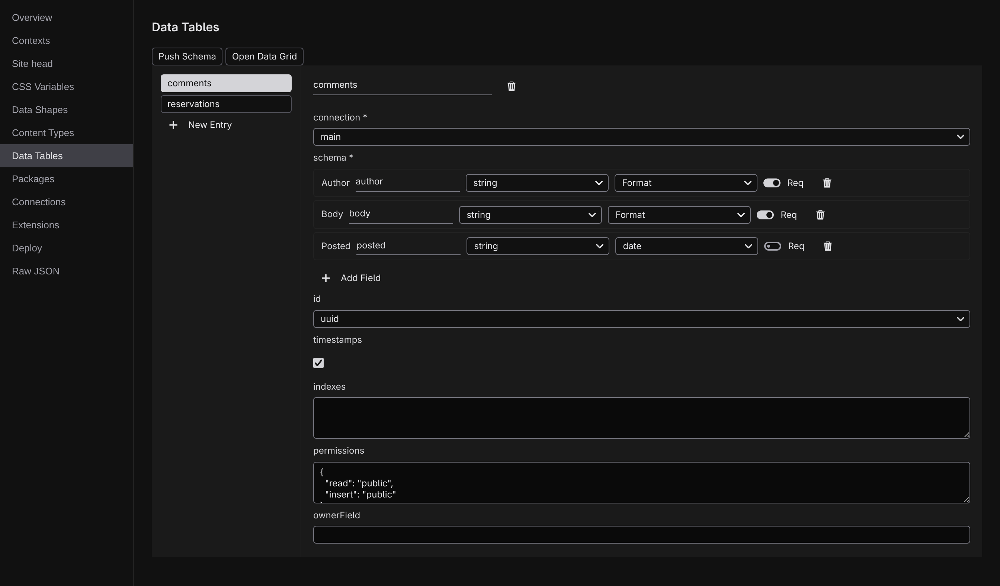

# Databases

Your content collections are files in your project, right for pages, posts, and anything you write and publish. A database holds the other kind of data: rows that appear and change while the site runs (comments, sign-ups, orders, form submissions). The connector extension adds that half to Jx: you describe your database and its tables in Studio, pages read and write the rows, and a spreadsheet-style grid lets you browse and fix the data at any time.

You don't need to have run a database before. The default setup is a single file inside your project (nothing to install, no account to create), and the same table definitions carry over unchanged when you later point them at a hosted service.

## Where it lives

Open **[Project settings](/docs/studio/projects/settings)** from the ⚙ **Settings** menu at the foot of the rail, by pressing :kbd[⌘K] and running **Open Project Settings**, or from the **⬢ menu** in the Command Bar. Projects with the connector extension enabled get two extra sections in the list:

- **[Connections](/docs/studio/data/connections)**: which database (or databases) the project talks to.
- **[Data Tables](/docs/studio/data/tables)**: the tables inside them, with their fields, ids, and access rules.

Both sections carry an action row with **Test Connection**, **Push Schema**, and **Open Data Grid**. The grid opens as its own tab on the canvas; see **[Data grid](/docs/studio/data/grid)**.

:::doc-note
The sections are contributed by the `@jxsuite/connector` extension, listed in the `extensions` array of `project.json`, the same mechanism that brings Content Types. Everything you edit in them is stored as the `connections` and `data` sections of `project.json`; only the table _definitions_ live there. The rows themselves stay in the database. See [project.json](/docs/framework/site/project-json).
:::

## From empty to live data

1. **Add a connection.** Name where the data lives. A new connection starts as SQLite, a database file inside your project that works immediately.
2. **Define tables and push.** Build each table's fields in the visual schema builder, then **Push Schema** creates the real tables. A dry-run plan always shows you what will happen first, and pushes only ever _add_; they never drop or rewrite what exists.
3. **Browse in the grid.** Insert, edit, and delete rows in a paged spreadsheet view.

Pages then use the data through the **[Data panel](/docs/studio/logic/data)**: the connector provides table query and table action sources that list, filter, and write rows. They appear in the **+ Add…** picker like any other **[data source](/docs/studio/logic/data-sources)**, and a form's submit event can point straight at a table insert.

## Local and deployed

While you build, everything runs against local files:

- A **SQLite** connection is a file at `.jx/data/<name>.sqlite` inside your project, created on first use.
- A **Cloudflare D1** connection is stood in locally by a SQLite file of the same kind, so you develop against it without touching the real database. Deployed, the same tables live in D1 itself.
- A **Supabase** connection is Postgres, a hosted service you connect to with a URL.

Anything secret (a database URL, an API token) never enters your project files: Studio stores values in the git-ignored `.dev.vars` file locally and only the _names_ travel anywhere. How that works (and what the auth extension adds) is covered in **[Auth and secrets](/docs/studio/data/auth-and-secrets)**.

## Availability

The database console needs a Studio backend that can reach databases: the local dev server and the **[desktop app](/docs/studio/desktop)** both can. On a backend without database access the sections still show your definitions, but the Test, Push, and grid actions stay hidden.

The command-line equivalent of the push button is `jx db push` (same plan, same additive rules), documented in the **[CLI reference](/docs/framework/build/cli)**.

## Next

- **[Connections](/docs/studio/data/connections)**: add SQLite, D1, or Supabase
- **[Data tables](/docs/studio/data/tables)**: fields, relationships, permissions, and Push Schema
- **[Data grid](/docs/studio/data/grid)**: browse and edit the rows
- **[Auth and secrets](/docs/studio/data/auth-and-secrets)**: sign-ins, access rules, and the secret store
