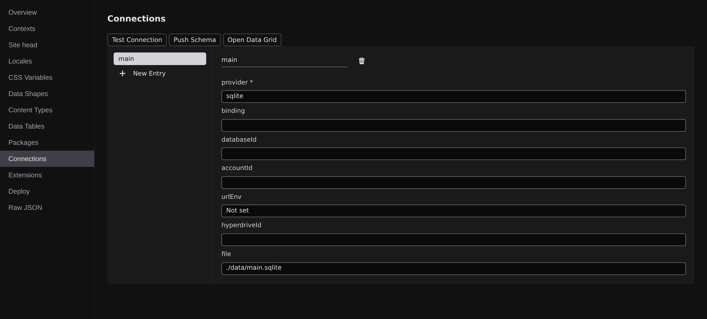

# Connections

A connection names a database your project talks to. Most sites need exactly one; you can add more if, say, orders and analytics live in different places.

Connections are a section of your project's configuration document. Press :kbd[⌘K] and run **Open Settings** (or pick it from the **⬢ menu** in the Command Bar), then choose **Connections** from the section list: your connections are listed on the left, and selecting one opens its form on the right. Like every other section of that document, a change here is a step you can take back with :kbd[⌘Z]; see **[Project settings](/docs/studio/projects/settings)**.

## Add a connection

1. Click **New Entry** at the bottom of the list.
2. Type a name (`main` is a fine first choice) and click **Create**.

The new connection starts on the **sqlite** provider: a database file inside your project, no installation and no account. If that's where you want to stay, you're done. The file is created the first time the database is touched.

To use a different backend, change the **provider** field to one of the ids below. The form is generated from the provider's own settings, and every field carries its explanation.

## SQLite: a file in your project

The zero-setup option, and the local stand-in the others build on.

- **file**: where the database file lives, relative to the project root. Leave it empty for the default, `.jx/data/<name>.sqlite`.

## Cloudflare D1: provider `d1`

Cloudflare's hosted SQLite, for sites deployed to Workers or Pages (see **[Publish to Cloudflare](/docs/studio/publish/cloudflare)**):

- **binding**: the name your deployed site reaches the database under.
- **databaseId**: the database's UUID from the Cloudflare dashboard. An identifier, not a secret.
- **accountId**: your Cloudflare account id; leave it empty to use the `CLOUDFLARE_ACCOUNT_ID` environment variable.

While you develop, a D1 connection is stood in by a local SQLite file at `.jx/data/<name>.sqlite`, so you build and test against your own machine, and the real D1 database is only touched when you push the schema to it or the deployed site runs. Reaching real D1 from outside a deployed Worker uses Cloudflare's API and needs a `CLOUDFLARE_API_TOKEN` value in your secrets.

## Supabase: provider `supabase`

A hosted Postgres service:

- **urlEnv**: the database connection URL. This field is a **secret field**: paste the URL from your Supabase dashboard and Studio stores the _value_ in the secret store, keeping only the environment-variable _name_ it's filed under (the field then reads "Stored as …"). See below.
- **hyperdriveId** and **binding**: for sites deployed to Cloudflare Workers, the Hyperdrive configuration that fronts the Postgres connection there. Leave both empty otherwise.

## Names on file, values in the vault

Nothing secret is ever written into your project: connection entries record identifiers and environment-variable _names_ only. When you paste a value into a secret field, Studio saves it under a name derived from the connection: the URL of a connection called `main` becomes `MAIN_URL`. Locally that value lands in the git-ignored `.dev.vars` file. The value is never shown back and never leaves the machine it's stored on. The full story, including what deployed sites use instead, is in **[Auth and secrets](/docs/studio/data/auth-and-secrets)**.

## Test a connection

Select a connection in the list and click **Test Connection** in the action row. Studio asks the backend to run a minimal probe query against that database and reports beside the buttons: "main: connected", or the error that came back (an unreachable host, a missing secret, a bad URL). The button is disabled until a connection is selected.

With a connection selected, **Push Schema** in the same row is scoped to just that connection. Table schemas and pushing are covered in **[Data tables](/docs/studio/data/tables)**.

:::doc-note
This section edits the `connections` section of `project.json`: one entry per connection, holding the provider id and the identifier fields above, never secret values. It is contributed by the connector extension, so it is listed once `@jxsuite/connector` is one of the project's **Extensions**. On backends without database access (see [Databases](/docs/studio/data)), the entries remain editable but the Test, Push, and grid actions are hidden.
:::

## Next

- **[Data tables](/docs/studio/data/tables)** defines what's _in_ the database.
- **[Auth and secrets](/docs/studio/data/auth-and-secrets)** covers where the secret values actually live.
