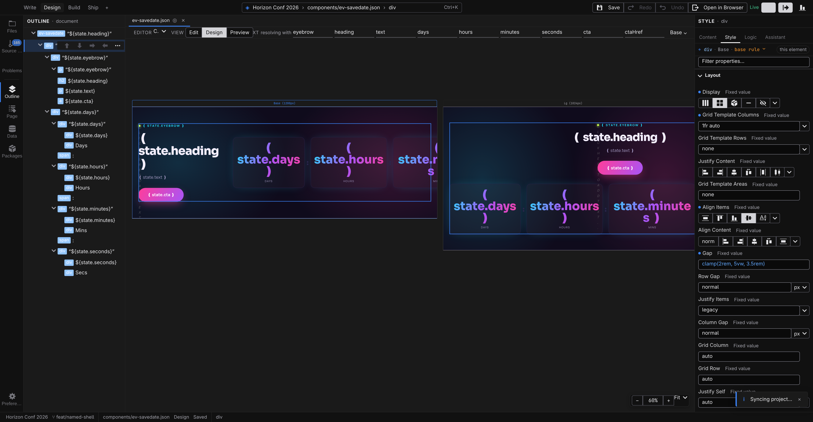

# Breakpoints

A breakpoint is a named screen-size condition — Tablet, Desktop — at which your design is allowed to change. In Design mode every breakpoint gets its own live canvas panel, labeled with its name and width, all showing the same page at once. The responsive rules evaluate for real in each panel, so you never wonder what the phone view looks like — it's right there next to the desktop one.

## The active breakpoint

Styling always targets one breakpoint at a time. Two controls choose it, and they are the same setting:

- The pane's **Context** control — its **Size** group lists **Base** plus one button per breakpoint.
- The **panel headers** on the canvas — click a panel's header to make its breakpoint active.

Pick **Base** to edit the styles that apply everywhere; pick a breakpoint to edit that screen size's overrides. Whichever you use, the [Style tab](/docs/studio/design/style-inspector)'s Target Line states the answer — `⌖ h1 · @Tablet` — so the breakpoint you're editing is on screen beside the fields you're editing it with.

## How the cascade works

Base is the design; breakpoints are exceptions to it:

1. Values set at **Base** apply at every size.
2. On a breakpoint, everything inherited from earlier in the cascade shows as a dimmed placeholder — nothing is duplicated.
3. Every inherited value **names the breakpoint it came from**: the field's chip reads **from Base**, or **from Tablet**, and clicking it switches to that breakpoint so you can edit the value at its source.
4. Set a value while a breakpoint is active and it becomes an override for that breakpoint only, marked with an accent dot.
5. Click the dot to remove the override; the inherited value shows through again, and its chip says where from.

Breakpoints layer in the same order a browser applies their media queries, so what you see per panel is exactly what ships.

## Define your breakpoints

Breakpoints are defined in one place: **Settings › Contexts**. Click the **Settings** gear at the bottom of the activity bar and pick **Contexts**, or open the context bar's **Context** popover and click **Manage contexts…** at the bottom of it — which gets you there without losing your element selection.

The section holds three groups, because all three are the same thing on disk and only differ in what their condition asks about:

- **Size breakpoints** — width conditions like `(max-width: 768px)`. These are the ones that get their own canvas panel.
- **Colour schemes** — a Light/Dark picker that writes the `prefers-color-scheme` query for you, so a scheme can never be mistyped into something else.
- **Feature queries** — anything else a media query can ask: reduced motion, print, hover, orientation. These appear as toggles in the **Context** popover rather than as canvas panels.

Above them sits **Base width** — how wide the Base canvas panel renders when no other context applies.

Name a context in plain language; Studio derives the stored name ("Wide screen" becomes `--wide-screen`). Every change is schema-checked and then written to `project.json`. If the schema refuses the value or the write fails, the reason appears under the control that caused it and the old value stays put — a refused edit never looks like the field forgetting what you typed.

A colour scheme is what turns on the **Auto / Light / Dark** control in the context bar's **Context** popover. Auto follows your OS preference; Light and Dark force that scheme on the canvas — exactly what a visitor's [color-scheme switcher](/docs/framework/concepts/color-schemes) does on the published site. The control appears only once the project declares a scheme.

Forcing a scheme while the size is **Base** points your edits at that scheme's overrides, and the Target Line grows a segment to say so — `⌖ h1 · Base · Dark variant`. Base values show through as inherited, their chips reading **from Base**, and clicking one sets the control back to **Auto** so you can edit the value where it lives. A size breakpoint is always breakpoint-scoped: schemes and sizes don't compound into a single block.

:::doc-note
**Definition and selection are separate.** Settings › Contexts is the only place a context is created, renamed or deleted. The context bar's **Context** popover only _chooses_ among what is defined there, and the Style tab's Target Line only _states_ what was chosen — clicking its breakpoint segment takes you to Settings › Contexts rather than offering a third list to disagree with.
:::

:::doc-note
Breakpoints are stored as a `$media` map in `project.json`. A single document may also carry a `$media` map of its own, which merges over the project's at render time. Per-breakpoint styles nest under the breakpoint's name inside each element's `style`, as described in **[Styling](/docs/framework/concepts/styling)**.
:::

## Next

- See which breakpoint an edit lands in while you style — **[Style inspector](/docs/studio/design/style-inspector)**
- Element defaults respond to breakpoints too — **[Stylebook](/docs/studio/design/stylebook)**
