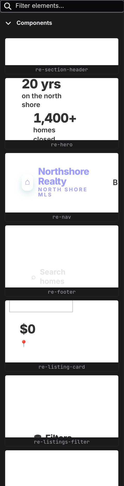

# Elements panel

Elements is the palette of things you can add to the page — the standard HTML building blocks plus your own components, laid out as cards. Open it by clicking **Elements** in the activity bar on the left.

## What's in the palette

- **Components** — at the top, your project's own components, plus components from installed packages once they're enabled for the project (see **[Dependencies](/docs/studio/projects/dependencies)**). Project components render a live preview on their card, so you see the real thing before you place it.
- **Element categories** — below, the HTML elements grouped by category in accordion sections. Each card shows a small preview of the element and its tag name.

Type in the **Filter elements…** box to narrow the palette by name; categories with no matches disappear. Click a category header to collapse or expand it. When a filter matches nothing at all, the panel says so and offers **Clear the filter** rather than leaving you with a blank column.

## Insert by click

1. On the canvas or in [Layers](/docs/studio/design/layers), select the element you want to insert into.
2. Click a card. The new element lands inside the selection, after its existing children.

With nothing selected, the element is added at the end of the document.

## Insert by drag

For an exact placement, drag the card instead:

1. Press and drag any card toward the canvas.
2. As you move over the page, an indicator line shows where the element will land — before, after, or inside the element under the cursor.
3. Drop to insert, or press :kbd[Esc] to cancel.

The new element arrives selected, ready for the [Properties panel](/docs/studio/design/properties) and [Style inspector](/docs/studio/design/style-inspector). Dragging works the same in Edit and Design mode; the other ways to insert — the **+** affordance between elements and the slash menu — are covered in **[The canvas](/docs/studio/interface/canvas)**.

:::doc-note
Inserting adds one element node to the open file — a component card adds an instance tag like `<site-card>`. The format is described in **[Components](/docs/framework/concepts/components)**.
:::

## Next

- Make your own cards appear here — **[Working with components](/docs/studio/design/components)**
- Rearrange what you inserted in the **[Layers panel](/docs/studio/design/layers)**
