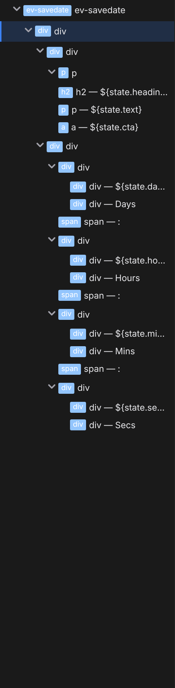

# Layers panel

Layers is the page's structure as a tree — every element in the open file, nested the way it nests on the page. Open it by clicking **Layers** in the activity bar on the left. Use it whenever the thing you want to grab is hard to click on the canvas: a wrapper with no visible edges, an element hidden behind another, or the exact parent in a deep stack.

## Read the tree

Each row shows a badge and a name. The badge tells you what the row is:

- The element's type — `div`, `h2`, `img`, and so on.
- **↻** — a [repeater](/docs/studio/design/repeaters), an element that renders once per item of a list.
- **⇄** — a switch, an element that shows one of several cases; each case appears as a child row named after the case.
- **▣** — a slot, the placeholder where a component or layout receives content. Hover it to see the slot's name.

Text sits in its own dimmed, italic rows, and rows with children get a chevron — click it to collapse or expand that branch without changing the selection.

## Select and navigate

Click a row to select that element. The canvas pans to bring it into view, and the [Properties panel](/docs/studio/design/properties) and [Style inspector](/docs/studio/design/style-inspector) switch to it. Selection works in both directions: click something on the canvas and its row highlights and scrolls into view in Layers.

## Rename an element

Rows are named automatically from the element's content. To give one a name of your own — "Hero section" beats a `div` with a text preview — double-click the row, type the name, and press :kbd[Enter]. Press :kbd[Esc] to cancel, or commit an empty name to go back to the automatic label.

:::doc-note
The name is a display title only — Studio stores it as a `$title` key on the element in the file. It never changes what the page renders.
:::

## Rearrange the page

Hover a row and its actions appear on the right:

- **Move up** / **Move down** arrows swap the element with its neighbors.
- The **right arrow** moves the element inside the sibling above it (shown when that sibling can hold children).
- The **left arrow** moves the element out of its parent, to sit just after it.
- **✕** deletes the element and everything inside it.

For bigger moves, drag the **⠿** handle — or the row itself. An indicator shows where the element will land: above or below the row under the cursor, or inside it as a child. You can also drag a row straight onto the canvas and drop it at the spot you see. Press :kbd[Esc] mid-drag to cancel with nothing changed. Dropping an element into itself or its own descendants is blocked.

## Right-click for everything else

Right-clicking a row opens the same context menu as the canvas — **Copy**, **Duplicate**, **Copy styles**, **Wrap in Div**, **Repeat…**, **Convert to Component**, **Delete**, and more. The full list is in **[The canvas](/docs/studio/interface/canvas)**. **Set Title** in that menu starts the same rename as double-clicking.

In **Stylebook** mode the Layers activity switches to the element catalog instead of the document tree — see **[Stylebook](/docs/studio/design/stylebook)**.

## Next

- Add new elements from the **[Elements panel](/docs/studio/design/elements)**
- Inspect what you selected in the **[Properties panel](/docs/studio/design/properties)**
