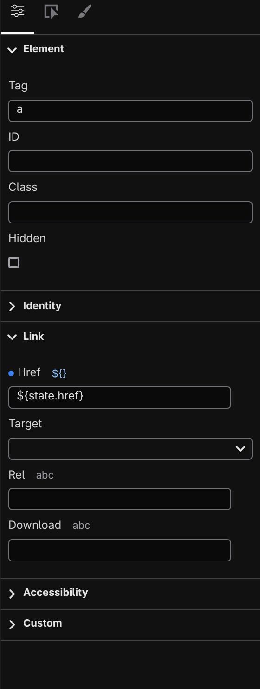

# Properties panel

Properties is the first tab of the right panel — alongside **Events** and **Style** — and it edits everything about the selected element that isn't styling: what kind of element it is, its attributes, and, for component instances, their settings. Select an element on the canvas or in [Layers](/docs/studio/design/layers), then click **Properties** at the top of the right panel.

With no file open the panel offers **Open a page…**; with a file open and nothing selected it asks you to click anything on the canvas. The **Style** and **Events** tabs ask for the same thing in the same words, so the whole right panel reads as one requirement rather than three.

## The Element section

Every element starts with the same basics:

- **Tag** — the element's type. Change it to turn a `div` into a `section`, a `p` into an `h2`.
- **ID** and **Class** — the element's identifier and CSS classes.
- **Text Content** — the element's text, shown when it has no child elements.
- **Hidden** — a checkbox that removes the element from the rendered page without deleting it.

A small dot appears next to any field that has a value; click the dot to clear it.

## Attribute sections

Below the basics, Studio shows only the attributes that apply to the selected element's type, grouped into sections — **Identity**, **Link**, **Media**, **Form**, **Table**, and **Accessibility**. An image gets its source, alt text, and loading behavior — the source field has **Upload** and **Browse** buttons beside it, so you can add a new picture to the project or pick one you already have without leaving the panel ([Media](/docs/studio/projects/media)); a form input gets its name, placeholder, and validation attributes; a plain `div` gets almost none of these. Sections that already have values open automatically and show a dot on their header.

Links get special treatment. On an `a` element, the **Link** row pairs a kind picker — **Internal Page**, **External URL**, **Anchor**, **Email**, **Phone** — with the matching input; choosing **Internal Page** lists your site's pages so you pick a destination instead of typing a path. The **Open in** attribute becomes a dropdown of the standard targets.

Anything not covered lives in the **Custom** section: click **+ Add attribute** to add any attribute by name, edit its value inline, or remove it with **✕**.

## Component settings

When the selection is a component instance, a **Component Settings** section lists the options the component exposes — see **[Working with components](/docs/studio/design/components)**. Each one gets a control matched to its type: a checkbox for on/off options, a number field, a dropdown for a fixed set of choices, a media picker for images, a color control for colors. The mode button beside each label switches it between a fixed value, a state binding, and a template, and **→ Edit definition** opens the component itself. A component with no options declared yet says so instead of showing an empty section.

## Make any value dynamic

Most fields carry a small mode button beside their label showing the current mode's glyph. Clicking it steps to the field's next mode — **abc** is a plain value; **$ref** points the field at a state value; **${}** builds the value from a template that mixes text and data — and wraps back around, swapping the field's editor in place. Studio remembers each mode's value for the session, so cycling back restores what you had there. The state values on offer come from the document's **State** panel — see **[Script & logic](/docs/studio/logic)**.

## Page and root settings

Select the page root — the topmost row in Layers — and extra sections appear:

- **Page** (site pages only) — pick the page's **Layout**: the site default, none, or any layout in the project. See **[Pages, layouts, components](/docs/studio/projects/pages-layouts-components)**.
- **Media** — the file's breakpoints. Covered in **[Breakpoints](/docs/studio/design/breakpoints)**.

Special elements swap in their own sections too: a repeater shows a **Repeating list** section (see **[Repeaters](/docs/studio/design/repeaters)**), and a **Condition** element lists its cases with an expression field.

## Layout elements

A page's **[layout](/docs/studio/projects/pages-layouts-components)** puts its own content around yours — a header, a footer, a `<noscript>`. Those regions render dimmed and carry a `LAYOUT · layouts/base.json` chip, so it's clear at a glance which parts aren't coming from the page you're on, and clicking one selects it: the panel shows a read-only **Layout Element** section with the element's tag, its classes, and the layout file it comes from. (The containers that merely _wrap_ your page content stay ordinary, or the whole document would dim.)

Layout content is not editable from the page that uses it — one page must not silently rewrite the header of every other. **Open Layout →** opens the layout file in the tab with that same element already selected, and from there it's ordinary editable content.

:::doc-note
Every field writes a key on the selected element in the open file — attributes into `attributes`, component props into `$props`. The file format is described in **[Components](/docs/framework/concepts/components)**.
:::

## Next

- Style the same selection in the **[Style inspector](/docs/studio/design/style-inspector)**
- Bind props and attributes to real data in **[Script & logic](/docs/studio/logic)**
