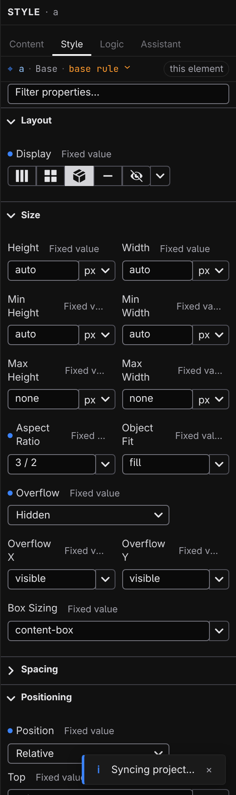

# Style inspector

The Style inspector is the **Style** tab of the right panel — a full set of visual CSS controls for the selected element. Select an element in Design mode and click **Style** at the top of the right panel; edits apply to the live canvas as you make them.

## The toolbar

Two controls sit above the sections:

- **Breakpoint tabs** — **Base** plus one tab per breakpoint. Base values apply everywhere; a breakpoint tab edits overrides for that screen size only. See **[Breakpoints](/docs/studio/design/breakpoints)**.
- **Scheme layer** — no extra tab: when the tab bar's Auto/Light/Dark control forces a scheme the project declares, Base-context edits target that scheme's overrides instead, and a "Dark variant"-style badge appears beside the tabs. Base values show through as dimmed placeholders. Switch back to **Auto** to edit base styles; breakpoint tabs always stay breakpoint-scoped.
- **The selector menu** — style the element's `:hover`, `:focus`, and other states, or a selector of your own. See **[Hover states and selectors](/docs/studio/design/states-and-selectors)**.

Below them, the filter bar narrows the property list: type part of a property's name, or switch on **Active** to show only properties that have values. While filtering, every matching section stays open.

## Sections

Properties are grouped into accordion sections: **Layout**, **Size**, **Spacing**, **Positioning**, **Typography**, **Background**, **Border**, and **Effects**. Sections that already have values open automatically.

A dot is the inspector's "this is set" signal, and it doubles as the eraser:

- A dot next to a property means it has a value here — click the dot to clear it.
- A dot on a section header means something inside is set — click it to clear the whole section.

Some rows appear only when they're relevant — alignment and gap controls show once the element's display makes them meaningful, for example. A row whose value no longer applies is flagged so you can spot leftovers.

## The inputs

Each property gets a control built for it:

- **Number + unit** — type the number, pick the unit (`px`, `rem`, `%`, `vw`, and friends) or a keyword like `auto` from the attached menu.
- **Color** — a swatch that opens a full picker, with your project's color tokens on offer; a token shows by its name, like **Primary Blue**. See **[Design tokens](/docs/studio/design/tokens)**.
- **Font family** — a combobox listing your font tokens and a set of ready-made font stacks; the menu previews each option in its own face. Picking a preset saves it as a font token automatically.
- **Keyword menus** — properties with fixed values get a dropdown; typography menus preview each choice (weights render at their weight, transforms as they transform).

Shorthand rows like **Padding** and **Margin** take a combined value, or expand with their chevron into per-side fields; border rows expand into width, style, and color. Studio recombines the sides into the shortest form when it writes the value.

When a value comes from somewhere earlier in the cascade — the Base tab, an earlier breakpoint — it shows as a dimmed placeholder rather than a set value, so you always know what you'd be overriding. Style values also accept the **${}** dynamic mode from their mode button, so a property can follow your data — see **[Script & logic](/docs/studio/logic)**.

## Custom and relative styling

Two sections close the list:

- **Custom** — any CSS property by name. Type the property, press :kbd[Enter], and fill in its value; each row shows the property's browser default as a placeholder.
- **Relative Styling** — rules for elements _inside_ the selection (the rows inside a table, the links inside a nav). Click a rule to drill into it and edit it with the full inspector; **+ Add** opens a dialog where you type the selector (`th`, `:hover`, `.active`) and click **Add**.

:::doc-note
Everything here writes plain CSS into the element's `style` object in the open file — the same nested format documented in **[Styling](/docs/framework/concepts/styling)**.
:::

## Next

- Set element-wide defaults instead of styling one element at a time — **[Stylebook](/docs/studio/design/stylebook)**
- Name your colors, fonts, and sizes in **[Design tokens](/docs/studio/design/tokens)**
