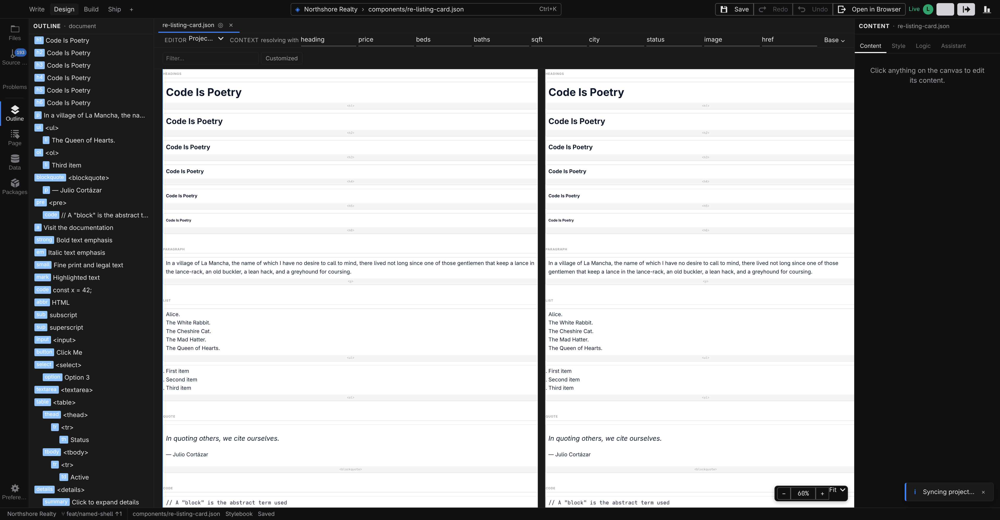

# Stylebook

Stylebook is a canvas mode that catalogs your elements — every heading, paragraph, button, list, table, and form control, plus your components, rendered as specimen cards with their current default styles. Instead of styling one `h2` on one page, you style what _every_ `h2` looks like, in one place. Switch to it with **Stylebook** in the mode switcher on the right side of the toolbar.

Your project file opens in Stylebook automatically — that's the natural home for site-wide defaults. Opening Stylebook on a page or component styles that file's element defaults instead.

## Read the catalog

Like Design mode, Stylebook shows one panel per breakpoint, all rendering the same catalog — so an element default that changes at Tablet is visibly different in the Tablet panel. The catalog renders through the real runtime, exactly as the defaults will render on your pages.

Two controls sit above the canvas: a **Filter** box to narrow the catalog by name, and a **Customized** toggle to show only the elements you've already styled. The **Outline** panel mirrors the catalog as a tree — elements with their nested parts (a table with its rows and cells), then your components — and marks customized entries with a dot.

## Style an element type

1. Click a specimen card on the canvas, or its row in **Outline**. The Inspector switches to the **Style** tab on its own, headed **Styling: &lt;h1&gt;** (or whatever you picked).
2. Edit styles with the full [Style inspector](/docs/studio/design/style-inspector) — sections, set-dots, and all.
3. Watch every panel update: you're styling the element type, so every specimen of it changes at once — and so does every matching element in your project.

The inspector's toolbar works the same as in Design mode: **breakpoint tabs** scope a default to a screen size (see **[Breakpoints](/docs/studio/design/breakpoints)**), and the **selector menu** adds states — give every link a default `:hover` in one edit (see **[Hover states and selectors](/docs/studio/design/states-and-selectors)**). Nested parts style as compound selections, like the header cells inside tables.

## Stylebook, element styles, or component styles?

Three layers, from broadest to narrowest:

- **Stylebook defaults** — "every `h2` looks like this." Your typography, link, and form baseline. Change it here and the whole site follows.
- **Component styles** — "this card component looks like this, wherever it's used." Style the elements _inside_ a component definition in Design mode; see **[Working with components](/docs/studio/design/components)**.
- **Per-element styles** — "this one element is special." The [Style inspector](/docs/studio/design/style-inspector) on a single selection, layered on top of both.

The narrower layer wins where they overlap, so keep the common look in the Stylebook and reserve per-element styling for true exceptions. [Design tokens](/docs/studio/design/tokens) slot in underneath all three — defaults built from tokens keep even your baseline swappable.

:::doc-note
Element defaults are saved as tag-named rules in the open file's top-level `style` — in `project.json` they become site-wide and merge into every page and component. The format is described in **[Styling](/docs/framework/concepts/styling)**.
:::

## Next

- Name the values your defaults are built from in **[Design tokens](/docs/studio/design/tokens)**
- How Stylebook fits among the modes — **[Modes and preview](/docs/studio/interface/modes)**
