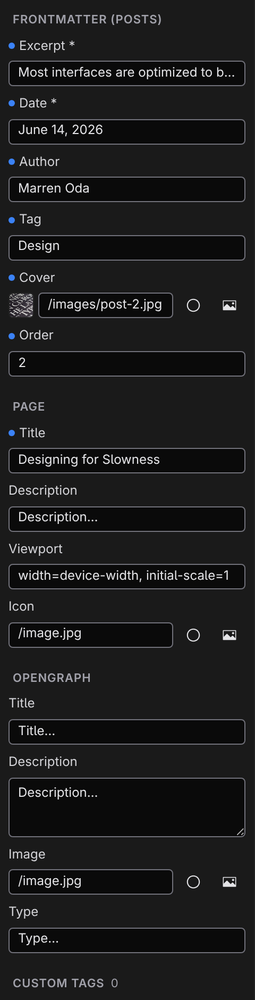
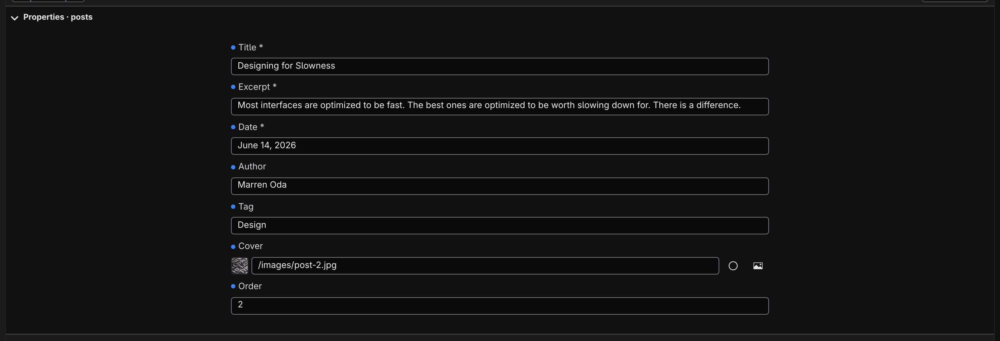

# Frontmatter and page metadata

Every page carries information that isn't part of its visible text: a title, a description for search engines, an image for social shares, and — for content like blog posts — fields such as a date, an author, or tags. This is the page's _frontmatter_, and Studio edits all of it as plain forms.

Two surfaces show these fields: the **Document** activity in the left panel, and a **Properties** bar above the canvas for content that belongs to a collection.

## The Document panel

Click **Document** in the activity bar to open it. Its sections, top to bottom, depend on the file you have open:

### Frontmatter

For a content page that belongs to a collection — a blog post, a product, a listing — this section lists the collection's fields, with required ones marked `*`. Each field gets a control that fits its type:

- Text fields, number fields, and date fields (dates as `YYYY-MM-DD`)
- On/off checkboxes
- A dropdown for fields with a fixed set of choices
- A media picker for image fields
- Comma-separated entry for list fields

Any extra field already present in the file appears too, even if the collection doesn't define it. Clearing a field removes it from the file entirely. Collections and their fields are defined in **[Content types](/docs/studio/projects/content-types)**.

### Layout

Site pages also get a **Layout** picker: keep the project default, choose a specific layout, or pick **None** — see **[Pages, layouts, components](/docs/studio/projects/pages-layouts-components)**.

### Page

The basics every page should have:

- **Title** — the browser-tab and search-result title.
- **Description** — the summary search engines show under the title.
- **Viewport** — leave the suggested default unless you have a specific reason not to.
- **Icon** — the small icon in the browser tab, picked from your media.

### OpenGraph

The card shown when the page is shared on social platforms: **Title**, **Description**, **Image**, and **Type**. If you fill in nothing else, fill in these and the Page section — they're what links to your site look like elsewhere.

### Custom Tags

The escape hatch for everything else that can live in a page's head — analytics, a verification token, a webfont. Pick a tag (`meta`, `link`, or `script`), type its attribute and value, and click the add button. Existing custom entries are listed with a remove button each; before you add the first one the section says what it's for, with the add form right beneath. Most sites never need this section.

## The Properties bar

When a collection page is open in Edit mode, a **Properties** bar sits directly above the page — the same fields as the Document panel's Frontmatter section (title included), right where you're writing. Click its header to collapse it to a slim strip; every tab remembers whether you left it open or closed.

:::doc-note
On disk, all of this lives at the top of the page's own file, in a small labeled block above the content — the frontmatter. That's why metadata travels with the page: copy the file and everything comes along, and any text editor can read it.
:::

## Next

- Edit a whole collection's frontmatter at once in **[Grid mode](/docs/studio/editing/grid)**
- Define collections and their fields in **[Content types](/docs/studio/projects/content-types)**
