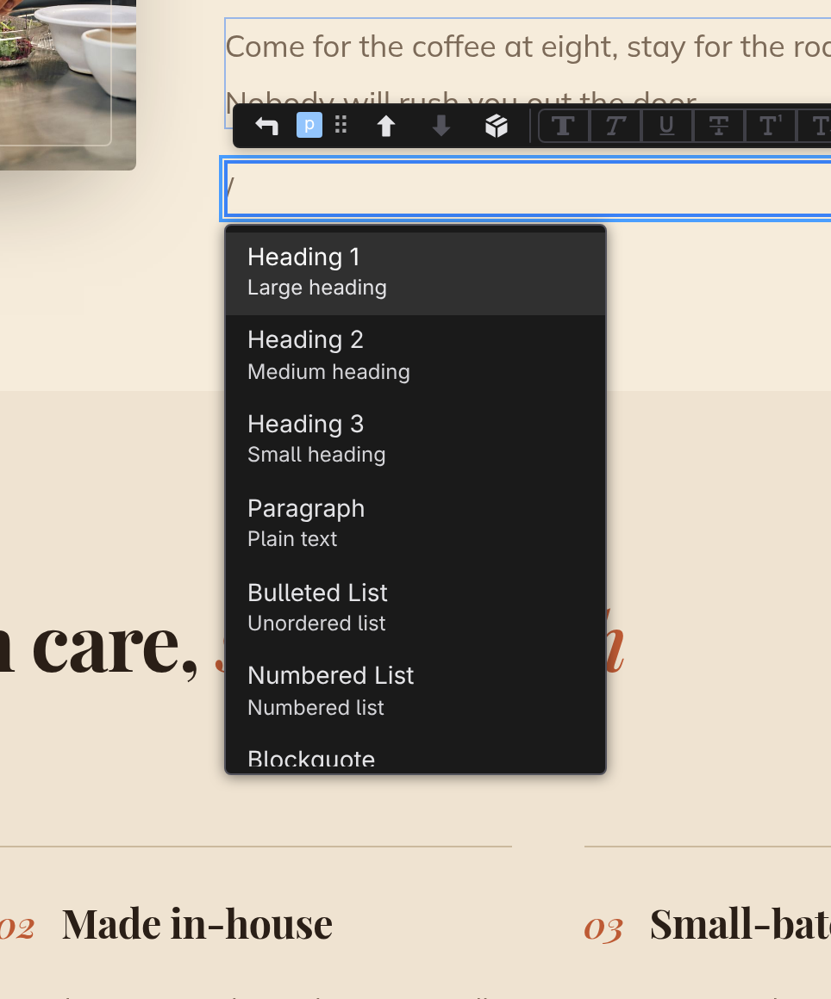

# Slash commands

The slash menu inserts blocks without leaving the keyboard: while editing text, type `/` and a menu of everything you can insert opens under your cursor. It's the fastest way to build a page up from a blank paragraph.

## Insert a block

1. While editing text, type :kbd[/] on an empty line or after a space.
2. Keep typing to filter the list: `he` narrows to the headings, `img` finds Image.
3. Move through the matches with :kbd[↓] and :kbd[↑], then press :kbd[Enter], or click an entry.
4. The block appears and you're already editing it, so keep typing.

On an empty paragraph, the paragraph itself becomes the block you chose. On a line that has text, the text stays where it is and the new block lands right after it.

To close the menu without inserting anything, press :kbd[Esc], click anywhere else, or delete back past the `/`. And a slash in the middle of a word ("and/or") just types a slash; the menu only opens at the start of a line or after a space.

The menu also has a name. **Insert: Insert Block…** in the command palette (:kbd[⌘K]) opens the same list at the caret, which is how you reach it without typing anything. Bind it to a key of your own in **Preferences › Keyboard**, or ask the assistant for it. Opened that way there is no `/` in your text to filter against, so the menu brings its own filter field, and choosing a block leaves everything you have written exactly where it is.

## The block list

| Command             | What you get      |
| ------------------- | ----------------- |
| **Heading 1**       | Large heading     |
| **Heading 2**       | Medium heading    |
| **Heading 3**       | Small heading     |
| **Paragraph**       | Plain text        |
| **Bulleted List**   | Unordered list    |
| **Numbered List**   | Numbered list     |
| **Blockquote**      | Quote block       |
| **Image**           | Image             |
| **Horizontal Rule** | Divider line      |
| **Button**          | Button element    |
| **Link**            | Anchor link       |
| **Code Block**      | Preformatted code |
| **Table**           | Table             |
| **Div**             | Container         |
| **Section**         | Section container |

Filtering matches either the name or the element's short tag, so `ol` finds Numbered List and `h1` finds Heading 1.

:::doc-tip
The same menu appears when you click the name badge on the block action bar to convert a selected element into something else; see **[The canvas](/docs/studio/interface/canvas)**.
:::

## Next

- Everything else about writing on the page: **[Writing and formatting](/docs/studio/editing/writing)**
- The other ways to add elements, the + affordance and drag and drop: **[The canvas](/docs/studio/interface/canvas)**
