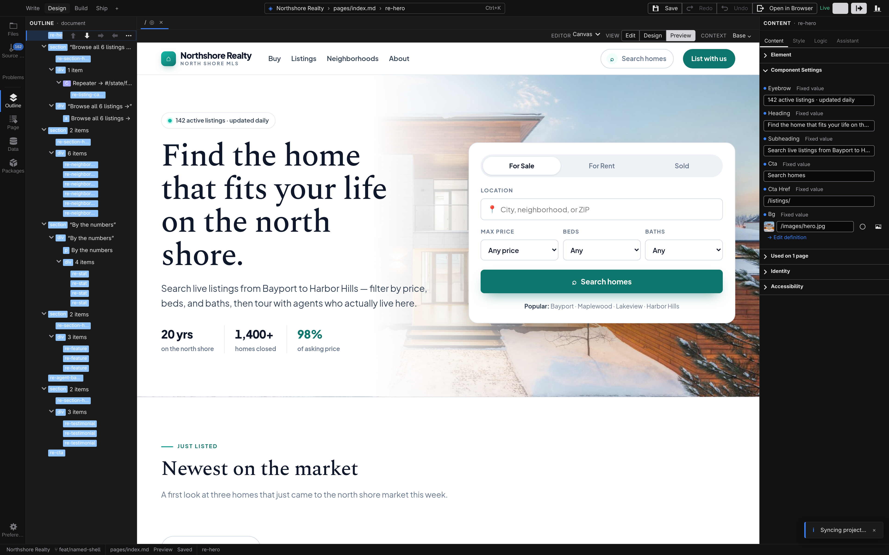

# The workspace

The Jx Studio window is one workspace with a fixed set of regions: a toolbar on top, an activity bar and panel on the left, the canvas in the center with its tabs above, an inspector panel on the right, and a status bar along the bottom. This page walks through each one. For a quicker orientation, start with **[A tour of Jx Studio](/docs/start/studio-tour)**.

## Toolbar

The toolbar runs across the top of the window.

On the left:

- **Open Project** opens a project folder. The chevron beside it drops down a menu with **New Project…**, your recent projects (each with a remove button), and **Clear recent projects**.
- **Manage** opens the project browser — see [Browse your project](/docs/studio/projects/browse).
- **Publish** opens the publish panel — see [Git & publish](/docs/studio/publish).
- **Save** writes the active file to disk. It's only enabled when the file has unsaved changes — Studio never saves on its own. See [Tabs and files](/docs/studio/interface/tabs).
- **Undo** and **Redo** step through the active file's edit history.

In the middle, the **Search files…** field opens [Quick Access](/docs/studio/interface/quick-access). When your project has new commits waiting on the remote, a **Sync Project** button appears here to pull them.

On the right:

- The **mode switcher** — **Edit**, **Design**, **Grid**, **Code**, **Stylebook** — changes how the canvas presents the open file. See [Modes and the preview toggle](/docs/studio/interface/modes).
- A toggle collapses and restores the right panel.
- A chat icon toggles the Assistant sidebar.

In the desktop app, the window's minimize, maximize, and close controls also live in this row.

## Activity bar

The vertical icon strip on the far left picks what the left panel shows. From top to bottom:

- **Files** — the project file tree. Open, rename, and organize the files in your project folder. **New File…** — from the panel's toolbar, or from a folder's right-click menu — opens a dialog with `untitled.json` pre-filled and the extension left unselected, so typing replaces just the name. Studio picks the starting content from the extension you give it.
- **Layers** — the element structure of the open page or component, as a tree you can select and reorder. In **Stylebook** mode it lists the style targets instead.
- **Imports** — the components and packages the open document (or project) pulls in.
- **Elements** — the palette of elements and components you can insert, organized by category with a search filter.
- **State** — the values, data sources, and functions the open component knows about. See [Script & logic](/docs/studio/logic).
- **Data** — the live, resolved values of that state as the page runs.
- **Document** — page-level settings: the title, the tags that go in the page head (description, social previews), and the layout the page uses.
- **Source Control** — the built-in git client. A badge on the icon counts changed files. See [Git & publish](/docs/studio/publish).

Clicking the icon of the activity that's already open collapses the left panel; clicking any icon brings it back. **About** and **Settings** buttons sit at the bottom of the strip.

## Left panel

The left panel shows the selected activity. Drag its inner edge to resize it — anywhere from a narrow strip to half the window — and double-click the same edge to snap back to the default width.

## Right panel

The right panel inspects whatever is selected on the canvas, in three tabs:

- **Properties** — the selected element's settings: its text, links, images, and component options.
- **Events** — what the element does on click, input, submit, and other interactions. See [Script & logic](/docs/studio/logic).
- **Style** — the visual inspector: spacing, typography, color, layout, and more. See [Design mode](/docs/studio/design).

Resize it by dragging its inner edge, or collapse it entirely with the toggle at the right end of the toolbar.

:::doc-note
Studio remembers your layout — panel widths and which panels are collapsed carry over to your next session.
:::

## Canvas

The center region renders the open file live. How you interact with it depends on the current mode; panning, zooming, selection, and direct manipulation are covered in **[The canvas](/docs/studio/interface/canvas)**.

## Tab strip and tab bar

Two rows sit between the toolbar and the canvas:

- The **tab strip** shows one tab per open file, with a dot marking unsaved changes.
- The **tab bar** below it carries per-file controls: a **Back** breadcrumb when you've drilled into a nested component, zoom controls, the **Preview** toggle, and mode-specific actions like **Export** in Code mode.

Both are covered in **[Tabs and files](/docs/studio/interface/tabs)**.

## Status bar

The strip along the bottom of the window shows:

- The selected element and its **path** — the chain of elements from the page root down to your selection. Each step in the path is clickable, so you can jump to any ancestor.
- **Content Mode** when the open file is a content document.
- In **Stylebook** mode, the style rule you're editing.
- Short, temporary messages such as "Saved" after a save.

## Next

- Meet the five canvas modes in **[Modes and the preview toggle](/docs/studio/interface/modes)**
- Work directly on the page in **[The canvas](/docs/studio/interface/canvas)**
- Learn the **[keyboard shortcuts](/docs/studio/interface/shortcuts)**
