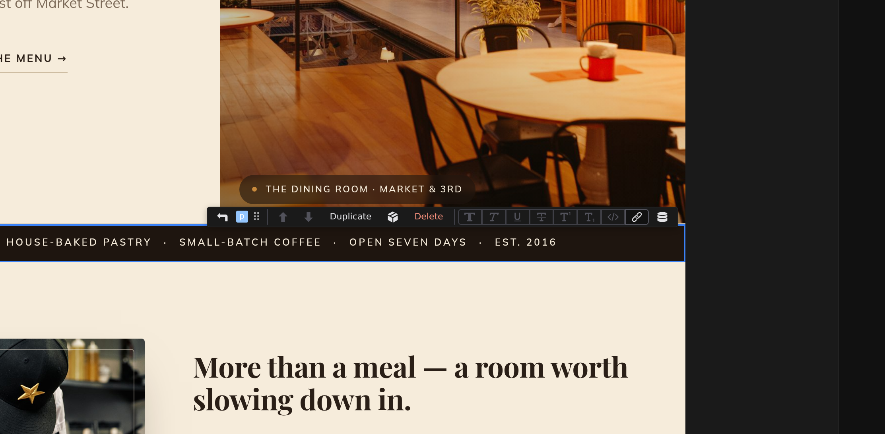

# The canvas

The canvas is the center of the workspace, where your page renders live — the real thing, not a mock-up. You work on it directly: click to put the cursor in the text and select the block, drag the block bar's handle to rearrange. How it behaves depends on the current [mode](/docs/studio/interface/modes); this page covers the interactions shared by the visual modes.

## Pan and zoom

In **Design** and **Stylebook** mode the canvas is an open surface you move around:

- **Pan** — scroll with the mouse wheel or trackpad. Hold :kbd[Shift] while scrolling to pan sideways, or drag with the middle mouse button.
- **Zoom** — hold :kbd[⌘] (macOS) or :kbd[Ctrl] (Windows/Linux) and scroll; the canvas zooms toward your cursor. :kbd[⌘=] / :kbd[Ctrl+=] zooms in, :kbd[⌘-] / :kbd[Ctrl+-] zooms out, and :kbd[⌘0] / :kbd[Ctrl+0] resets to 100%.
- The zoom controls in the tab bar do the same, plus **Fit** to bring the whole canvas into view.

**Design opens already fitted.** Switching into Design or Stylebook scales the canvas down so the whole thing is in view, so a wide layout never lands cut off at the edge of the panel. It never scales _up_ past 100%, and it never overrides you: once you have set a zoom yourself — with the controls, :kbd[Ctrl]-scroll or the chords — that file keeps your zoom for the rest of the session.

In **Edit** mode the page scrolls like a normal browser page instead of panning, and :kbd[Ctrl]-scrolling zooms the content itself — the text reflows at the new size, like browser page zoom. In **Preview** the page scrolls too, and there is nothing to pan or zoom — see **[Modes](/docs/studio/interface/modes)**.

## Selecting elements

Click any element to select it. Studio outlines it, the right panel inspects it, and the status bar shows its position in the page structure — a clickable trail of its ancestors.

That includes the parts of the page that come from its **[layout](/docs/studio/projects/pages-layouts-components)** — the header and footer render dimmed, under a `LAYOUT · layouts/base.json` chip, and clicking one selects it and offers **Open Layout →** in the right panel. They can't be typed into from here, because they belong to every page that uses that layout; see **[Layout elements](/docs/studio/design/properties#layout-elements)**.

You can also move the selection from the keyboard: :kbd[↑] and :kbd[↓] step between siblings, :kbd[←] selects the parent, :kbd[→] steps into the first child, and :kbd[Esc] clears the selection. The full list is in the **[shortcut reference](/docs/studio/interface/shortcuts)**.

## The block action bar

A small floating toolbar appears above the selected element:

- A **back arrow** selects the parent element.
- The **name badge** shows what's selected — the element's type or its name. When the element can become something else (a paragraph into a heading, for example), clicking the badge lists the conversions.
- The **⠿ drag handle** — drag it to move the element somewhere else on the page.
- **Move up** and **Move down** arrows swap the element with its neighbors.
- For a component instance, **Edit Component** opens the component itself; for anything else, **Convert to Component** turns the selection into a reusable component.
- While you're editing text, formatting buttons (bold, italic, and friends) and an **Insert data** button join the bar. See [Edit mode](/docs/studio/editing).

## Inserting elements

Three ways to add something to the page:

- **The + affordance** — move the pointer between two elements and a **+** appears at the insertion point. Click it and pick an element from the menu; the new element lands right there, selected.
- **The slash menu** — while editing text, type `/` at the start of a line to insert headings, lists, images, buttons, and more without leaving the keyboard. See [Edit mode](/docs/studio/editing).
- **The Elements panel** — open the **Elements** activity and drag an element or component card onto the canvas.

## Drag and drop

You can drag onto and around the canvas from almost anywhere: cards from the **Elements** panel, rows in the **Layers** panel, and the **⠿** handle on the block action bar. While you drag, an indicator line shows exactly where the element will land — before, after, or inside the element under the cursor. Drop to commit, or press :kbd[Esc] to cancel the drag with nothing changed.

Files from your desktop work too. Drop an image on empty space and Studio uploads it and inserts it there; drop it on a picture that's already on the page and it swaps that picture's source instead — the target highlights so you can tell the two apart before you let go. See **[Media](/docs/studio/projects/media)**.

## The right-click context menu

Right-click any element for the full action list: **Copy**, **Cut**, **Duplicate**, **Copy styles** and **Paste styles**, **Insert before** and **Insert after**, **Wrap in Div**, **Repeat…** (turn the element into a repeating list), **Set Title**, **Edit Component** or **Convert to Component**, and **Delete**. With something on the clipboard, **Paste inside** and **Paste after** appear too.

## Editing text

Click any text to put the cursor there and start typing. Everything about writing on the canvas — formatting, the slash menu, links — is covered in **[Edit mode](/docs/studio/editing)**.

## Next

- Style what you select in **[Design mode](/docs/studio/design)**
- Wire up behavior in **[Script & logic](/docs/studio/logic)**
- Keep your hands on the keys with the **[shortcut reference](/docs/studio/interface/shortcuts)**
