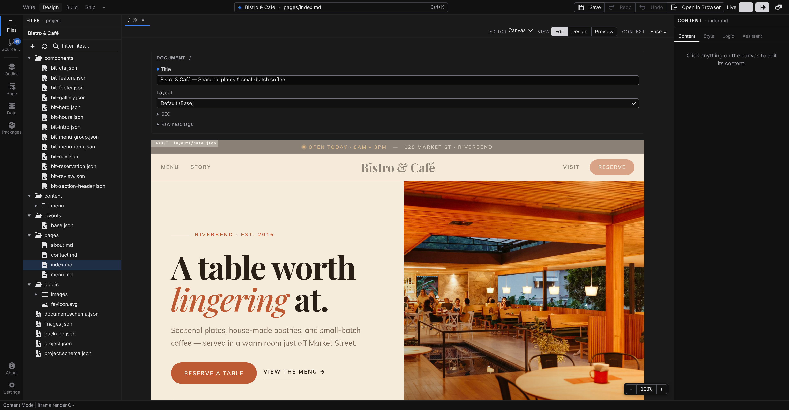

# Modes and views

Two controls on the [context bar](/docs/studio/interface/tabs) decide how the open file is presented, and they answer different questions. **Editor** is _which editor_ — **Canvas**, **Grid**, **Code**, **Diff** or **Project Styles** — and it lists only the editors this file supports, so there is nothing in it to be disabled. **View** is _which view of the canvas_ — **Edit**, **Design** or **Preview** — and it appears only while the Canvas editor is open. A view is a lens, not a different app: the same file underneath, shown the way that suits the job. Every open file remembers both as you switch between tabs.

## Edit

Edit is for writing. The canvas becomes the page itself — click any text and type, press `/` for blocks, fill in the page's metadata alongside. It reads like the finished page because it is the finished page. Full guide: **[Edit mode](/docs/studio/editing)**.

## Design

Design is for structure and style. The canvas shows a live panel per breakpoint — phone, tablet, desktop side by side — and the **Style** tab in the right panel becomes a full visual inspector for the selected element. Full guide: **[Design mode](/docs/studio/design)**.

## Grid

Grid is for tabular data. Files like CSV spreadsheets open as an editable table: click a cell to change it, and use the familiar copy, paste, and selection keys — they work on the table's rows and cells rather than the page. Cell edits collect in the tab until you **Save**, which writes them all back to the file at once.

## Code

Code shows the file as raw source in a full code editor with syntax highlighting — the same editor VS Code uses. It's the escape hatch when you want to see exactly what Studio wrote, and the **Export** button at the right of the context bar saves a copy of the file elsewhere. Everything you can do here you can also do visually; see **[Script & logic](/docs/studio/logic)** for where code fits in Studio.

## Stylebook

Project Styles is the catalog of your project's element defaults — every heading, button, and link rendered with its base style, so you set the look of each element type once for the whole site. Selecting it switches the right panel to the **Style** tab automatically. See **[Design mode](/docs/studio/design)** for how it fits into styling.

## Which files offer what

Every file opens in its natural editor and view, and the two controls offer only what that file supports:

| File                               | Opens in           | Editor also offers           | View also offers        |
| ---------------------------------- | ------------------ | ---------------------------- | ----------------------- |
| Markdown pages and content (`.md`) | **Canvas** · Edit  | **Code**                     | **Design**, **Preview** |
| Components and pages (`.json`)     | **Canvas** · Edit  | **Code**, **Project Styles** | **Design**, **Preview** |
| Spreadsheets (`.csv`)              | **Grid**           | **Code**                     | —                       |
| The project file (`project.json`)  | **Project Styles** | **Code**                     | —                       |

Installed format extensions can add their own file types with their own lists, so this table can grow with your project.

## Preview

**Preview** is the third value of the **View** control, beside Edit and Design — one control, three values, so the bar can never show you Design while the canvas is previewing. Pick it and the canvas shows the page with its real data resolved: dynamic text filled in, repeated lists expanded, exactly what a visitor gets.

What it resolves _with_ comes from the **Context** control beside it:

- For pages with dynamic addresses (a product page, a blog post), a picker per URL parameter so you choose which real record to preview.
- For components, a small field per component option so you can try test values.
- For pages that use a layout, a **Show layout elements** switch, inside the Context popover, that hides or shows what the layout contributes.

**Preview does not edit.** While it is on, clicking the page selects nothing, no outlines are drawn,
the insertion **+** and the canvas menu give way to your browser's own, nothing can be dropped in,
and the keys that change the document do nothing. Anything you had selected is still selected when
you switch Preview back off. Save, Undo and Redo keep working throughout.

**Preview scrolls like a real page.** Instead of the open surface you pan around in Design, Preview
puts one page-sized frame in the pane and lets it scroll itself — so sticky headers stick, elements
that animate as they come into view actually do, and anything that reacts to scrolling behaves the
way it will for a visitor. There is no zoom control in Preview for the same reason: it is showing
you the page at its real size.

Pick **Edit** or **Design** to go back to editing.

**Clicking a link in Preview opens that page in a new browser tab**, rather than replacing the canvas. Links within the same page — the ones that jump to a heading — still scroll where you would expect.

:::doc-tip
That new tab is the best way to check a project properly: it is your real browser loading the real page, so navigation between pages, your own JavaScript, server-side data, and anything that depends on a real URL all behave exactly as they will once the site is built. The canvas is for composing; the browser tab is for confirming.
:::

## Next

- Learn the canvas itself — pan, zoom, selection, inserting — in **[The canvas](/docs/studio/interface/canvas)**
- See how each tab remembers its editor and view in **[Tabs and files](/docs/studio/interface/tabs)**
