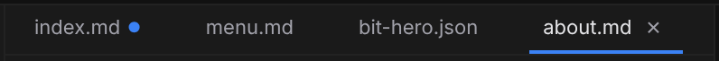

# Documents and panes

Every document you open in Jx Studio belongs to a **pane**. A pane is one editor over one document: its open documents sit in a strip along its top, a context bar under that says which editor and view you're in, and the document itself fills the rest. You can have one pane or two.

## Opening and switching

Open documents from the **Files** panel, the **[Library](/docs/studio/projects/browse)**, or the Command Center — :kbd[⌘K], or :kbd[⌘P] straight into file search. Click a document in the strip to switch to it; the Files tree follows along, so the strip and the tree never disagree about where you are.

- Switch back and forth with :kbd[⌃Tab] / :kbd[⌃⇧Tab], which walk your documents in the order you last used them rather than left to right.
- Close one with its **×**, by middle-clicking it, or with :kbd[⌘W].
- Reopen the last one you closed with :kbd[⌘⇧T].
- Drag to reorder. When more are open than fit, scroll the mouse wheel over the strip, or use the **⌄** button at its right edge to pick from the ones currently out of view.

## Labels

A document is named by the shortest part of its path that tells it apart from the others, so a project full of files called `index.md` still gives you four distinguishable names — and only the ones that actually collide grow a folder in front of them.

Pages are labelled by their **route** instead — `/`, `/blog`, `/blog/[slug]` — because that is the address the page is published at, and it is what you were thinking of when you opened it.

## Preview and pinned documents

A single click from the file tree or the palette opens a document in **preview**: it shows in _italics_ and the next single click replaces it, so browsing around never leaves you with twenty things open. Anything that commits to it makes it permanent — editing it, double-clicking it, pinning it, or running **Keep Document Open**.

**Pin** a document with the ◎ button on it (◉ once pinned) to hold it at the head of the strip, where no preview open can take its slot. Dragging can never interleave pinned documents with unpinned ones.

## Studio saves only when you do

Jx Studio does **not** auto-save. Edits live in the open document until you save:

- A **●** marks unsaved changes, the status bar reads **Unsaved changes**, and the **Save** button in the Command Bar lights up.
- Save with :kbd[⌘S] or the **Save** button. The status bar then says **Saved**, and how long ago, for as long as that stays true.

:::doc-warning
Closing a document with unsaved changes discards them. Studio always asks first — choose **Close** in the confirmation only if you really mean to throw the edits away. It only skips the question when a collaborator is still in the document, because the shared session keeps the edits.
:::

Undo and redo are per document as well: each keeps its own history, so :kbd[⌘Z] in one never unwinds work in another.

:::doc-note
Saving writes the file in place, in your project folder — plain Markdown, JSON, or CSV. Nothing is held in a database; what you save is what git sees. See [Git & publish](/docs/studio/publish).
:::

## Each document remembers its view

A document keeps its own view state while it's open. Switch from a Markdown page in **Edit** to a component in **Design** and back, and each returns exactly as you left it:

- its [editor and view](/docs/studio/interface/modes),
- its canvas position, and the zoom — but only once you have set one yourself; until then Design keeps fitting the canvas to the pane,
- its selected element and active Inspector tab.

New documents open in their natural editor — Markdown in **Edit**, spreadsheets in **Grid**, the project file in **Project Styles**.

:::doc-note
**Your project's configuration is one of these documents.** `project.json` opens in the strip like any file, and **Open Settings** shows it in its settings editor. That means the settings you change there are edits: an unsaved dot, :kbd[⌘Z] to take one back, :kbd[⌘S] to write it. Reaching it from the Files tree and reaching it from **Open Settings** land on the same document, so there is only ever one history and one unsaved state for it.
:::

## Drilling into a component

Opening a component from the canvas, the Outline tree or the Inspector's **Edit component** action gives it **its own place in the strip**. The page you came from stays open, still on the element you had selected, so you can flip between the two with a click or :kbd[⌃Tab].

The new one carries a small **↳** marker, and hovering it names the document you drilled in from.

## Two panes

:kbd[⌘\] splits the window in two. The active document moves into a second pane beside the first, on an editor that pane can host — **Code**, **Grid**, **Diff**, **Entry**, **Library** or **Project Styles** — so you can read a page's source, its fields, its data or its diff with the canvas still on screen. The canvas stays in the main pane.

- :kbd[⌘⌥0] focuses the side pane; **Focus Primary Pane** in the palette goes back.
- **Toggle Pane Zoom** fills the grid with the pane you're in, and puts both back.
- **Unsplit** collapses the split. Closing a pane never closes documents — they move back into the pane that remains.

Each pane has its own strip and its own context bar, and the focused pane is the one the Inspector, the Outline and the keyboard are pointed at.

## The pane context bar

Under each pane's strip, a labelled row states three things about the document in that pane — and only those three:

- **Editor** — which editor is open on it: **Canvas**, **Code**, **Grid**, **Diff**, **Entry**, **Library** or **Project Styles**. It offers only the editors this file actually supports, so it never holds an entry that cannot be picked, and a document with one editor prints its name as text rather than as a dropdown that goes nowhere. Those are the same names the [status bar](/docs/studio/interface#status-bar) prints, read from one list.
- **View** — for the Canvas editor, **Edit │ Design │ Preview** as one control with three values. See [Modes and views](/docs/studio/interface/modes).
- **Context** — what the page is being rendered _with_: the breakpoint, the color scheme, any feature queries, and whether the layout's own elements are shown. The summary reads at a glance (`Base · Auto`); open it for the full set, and for **Manage contexts…**, which takes you to where breakpoints and schemes are defined. Beside it, **resolving with** carries the document's own data — a picker per URL parameter on a dynamic page, a small field per option on a component.

**Back** and a breadcrumb trail appear at the left when you are inside part of a document that has no file of its own — a repeater's template, or a function body. Click any crumb to jump back up, and Studio puts you back exactly as you left it: same breakpoint, same selected element, same Inspector tab, same zoom.

**Zoom floats over the canvas**, bottom-right, rather than sitting in the bar: the zoom buttons, the percentage (click it for 100%), and a **fit** picker — **Fit page**, **Fit width**, **Actual size**, **No fit** — which is remembered per document, so coming back to a file frames it the way you left it. There is no zoom in **Preview**, which shows the page at its real size in a frame that scrolls itself.

Editor-specific actions sit at the right of the bar — **Export**, in the **Code** editor.

The bar is there when it has something to say. The settings editor takes the whole pane instead: a form has no canvas view to pick and no rendering context to resolve against, and contexts are _defined_ in a section of the very document it is showing.

## Next

- Find any file fast with **[Quick Access](/docs/studio/interface/quick-access)**
- Browse the whole project visually in **[the Library](/docs/studio/projects/browse)**
