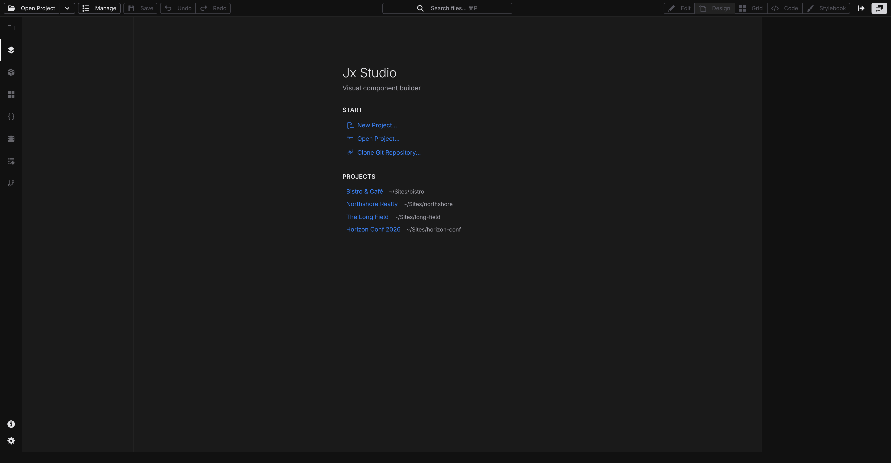

# Welcome screen

When Jx Studio starts with no project open, the canvas area shows the welcome screen: a **Start** list of ways to get a project in front of you, followed by your projects and recent history. Everything on it is one or two clicks from a working canvas.

## Start a new project

1. Click **New Project…**.
2. Pick where to start from: a built-in **Template**, a **Starter Site**, an **Import** of an existing site, or an **Agent** prompt describing what you want.
3. Click **Next**, name the project, and adjust the design quickstart (colors, fonts, logo).
4. Click **Create Project** — Studio writes the files and opens the project.

The full walkthrough is in **[Create a project](/docs/studio/projects/create)**.

## Open an existing project

1. Click **Open Project…**.
2. Choose your project folder in the picker that appears.

Studio opens the project and adds it to **Recent** for next time.

## Clone a git repository

This entry appears when your Studio setup can run git.

1. Click **Clone Git Repository…**.
2. Paste the repository URL and click **Clone**.

Studio clones the repository and opens it as a project. See **[Source control](/docs/studio/publish/source-control)** for everything git-related in Studio.

## Add an existing repository

This entry appears when Studio is connected to your GitHub account.

1. Click **Add Existing Repository…**.
2. Type in the filter field to narrow the list of repositories your account can reach.
3. Click a repository — Studio imports it and opens it as a project.

A repository must already contain a Jx project (a `project.json` file); if it doesn't, Studio tells you why it can't be added. Connecting your account is covered in **[Publish to GitHub](/docs/studio/publish/github)**.

## Repository access

If your account is connected but Studio can't reach your repositories yet, a **Repository access** section appears with an **Install the Jx Suite GitHub App** link. Follow it and choose **All repositories** so Studio can create and open projects on your behalf.

## Projects and Recent

Below the Start actions:

- **Projects** lists the projects your Studio installation knows about that you haven't opened recently. Click one to open it.
- **Recent** lists projects you've opened, newest first. Click one to reopen it, use the **✕** beside an entry to drop it from the list, or **Clear** to empty the list. Clearing the list doesn't touch the projects themselves — only the history.

:::doc-tip
You don't need the mouse: press :kbd[⌘P] (macOS) or :kbd[Ctrl+P] (Windows/Linux) on the welcome screen and [Quick Access](/docs/studio/interface/quick-access) lists your recent projects to reopen.
:::

## Next

- New to Jx? Follow **[Your first project](/docs/start/first-project)** end to end
- Once a project is open, get oriented with **[A tour of Jx Studio](/docs/start/studio-tour)**
