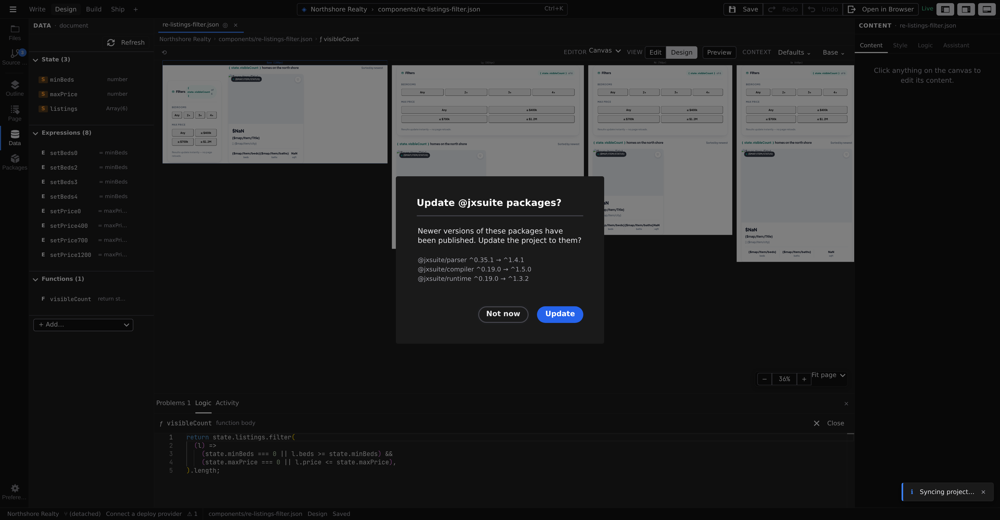

# Code editing

Everything in the Logic pages so far works without writing code. But Studio doesn't pretend code doesn't exist — when a function outgrows **[statements](/docs/studio/logic/statements)**, or you want to see exactly what a file contains, you get a real editor: Monaco, the same component that powers VS Code, with syntax highlighting, completions, and inline error checking.

There are two distinct code surfaces, for two different jobs.

## The function editor

A function body in **Code** mode (the **Statements**/**Code** toggle) is JavaScript. The small text field in the panel is fine for one line; for anything more, click the code icon — **Open in code editor** on a State-panel function, **Open in editor** on an inline event handler. The editor takes over the canvas, and the tab bar shows a breadcrumb — the file's name, then _ƒ_ and the function's name — with a **Back** button to return.

What you get:

- **Formatting on open** — the body is pretty-printed before you start.
- **Live linting** — problems are underlined as you type, with the message on hover.
- **Completions** — type `state.` to see every entry from the **[State panel](/docs/studio/logic/state)** (your values, data sources, and functions), and `window.` for the standard library (`Math`, `JSON`, …). Named formulas carry their descriptions into the suggestions.
- **Automatic write-back** — edits flow into the document as you type; there is no separate apply step. Save the file as usual when you're done.

Inside a body, `state` holds your entries (`state.$count += 1` is the code twin of a **Set state** statement), event handlers also receive `event`, and a function's declared parameters are available by name.

## Sidecar files

A function body normally lives inside the component's JSON. When one grows large enough to deserve its own file, it can live in a separate `.js` file instead: the function entry then shows **Source** (the file's path) and **Export** (which function to use from it) in the State panel, in place of a body. The format is documented in **[Components](/docs/framework/concepts/components)**.

## Code mode: the whole file as source

The **Code** entry in the toolbar's mode switcher shows the open file itself as raw source — JSON for pages and components, Markdown for content — as introduced in **[Modes and the preview toggle](/docs/studio/interface/modes)**. It's the same document the visual surfaces edit, from the other side:

- Edits parse back into the document as you type, so switching back to **Edit** or **Design** shows your changes. While the source is momentarily unparseable mid-edit, Studio simply waits — it never replaces your document with a broken parse.
- JSON files are checked against your project's own schema as you type — mistyped keys, wrong value types and missing required properties are underlined, and :kbd[Ctrl+Space] completes property names. Studio uses the `project.schema.json` and `document.schema.json` that [`jx schema`](/docs/framework/build/cli) generates from your enabled extensions, so the editor enforces exactly what `jx validate` does, including extension-contributed sections. It reads them directly, with no network access — an offline project still gets full validation.
- **Export** in the tab bar saves a copy of the file elsewhere.

:::doc-note
You never have to generate those files yourself: Studio refreshes them whenever they are missing or out of date, so a project you have never run `jx schema` on still validates, and turning an extension on or off updates the rules without a restart. In the browser at [studio.jxsuite.com](https://studio.jxsuite.com) the rules are composed for you on the server and nothing is written to your repository at all.
:::

## When to drop down

- A handler needs a loop, error handling, or an API the structured editors don't cover.
- You're doing a bulk edit — renaming a state entry everywhere it's referenced is a find-and-replace in Code mode.
- You want to add parameters to a named formula, or make other edits the panels don't surface.
- You're learning the format: build something visually, then read it in Code mode. It's the fastest way to understand what Studio writes.

:::doc-tip
Everything the visual editors do lands in the same file you see in Code mode — there is no hidden layer. If you can express a change in either surface, the result on disk is the same kind of JSON.
:::

## Next

- The file format you're reading in Code mode: **[Components](/docs/framework/concepts/components)** and **[Reactivity](/docs/framework/concepts/reactivity)**
- Prefer structure when it fits: **[Statements](/docs/studio/logic/statements)**
- Ship your work with **[Source control](/docs/studio/publish/source-control)**
