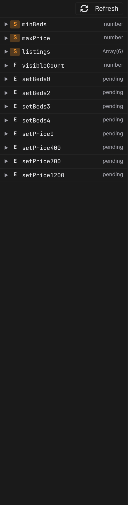

# Data explorer

Data is the read side of the **[State panel](/docs/studio/logic/state)**: the same entries, but showing what each one is worth **right now**, as the canvas runs the page — the actual list your fetch returned, the current count, the parsed form. Open it by clicking **Data** in the activity bar. When something on the page looks wrong, this is where you find out what the page actually sees.

## Read the values

Each state entry gets a row: its kind badge, its name, and a value summary —

- `Array(12)` — a list and how many items it holds.
- `{5}` — an object and how many fields it has.
- `string`, `number`, `boolean` — a plain value's type.
- `pending` — no value yet: a data source that hasn't finished resolving (or failed to).

Click a row to expand the value as a tree. Nested objects and lists unfold a few levels deep, long lists show their first items with a "… N more" tail, and long strings are shortened — enough to verify shape and content without drowning in data.

A page that declares nothing yet has nothing to show here, so the panel says what it is for and offers **Define data**, which takes you straight to the **[State panel](/docs/studio/logic/state)**.

## Refresh

The values are a snapshot from the canvas render. Click **Refresh** in the panel's toolbar to re-render the canvas and read them again — useful after editing a data source, or when you want to re-fire a fetch.

:::doc-note
While you are editing, **Fetch from a URL** sources do not call out to the network on their own — they sit empty until you ask. Editing the page re-renders the canvas many times, and re-running every fetch each time would be slow and would hammer the API. Click **Refresh** to fetch for real, or switch on the **preview** toggle, where data behaves exactly as it will on the built site.
:::

## Test values for component options

A component file renders on the canvas with its options at their defaults. To see it with real-looking data, use the option fields on the context bar, under **resolving with**: one small field per component option, as introduced in **[Modes and views](/docs/studio/interface/modes)**.

1. Open a component file. The context bar shows a field named after each option.
2. Type a test value. Values that read as JSON are treated that way — `42` is a number, `true` a flag, `["a","b"]` a list — and anything else is text.
3. The canvas re-renders with the value, and the Data activity, template previews, and formula badges all see it.
4. Clear the field to return that option to its authored default.

Test values are a preview aid — they live with your editing session, not in the component file.

## Debug with it

- A `pending` Request usually means the URL is wrong or the server didn't answer — check the entry in the State panel, then **Refresh**.
- A computed value that shows the wrong result: expand the entries it depends on here first; most "formula bugs" are actually surprising input data.
- Events not visibly doing anything? Trigger them with **Preview** on and watch the target entry's row change.

## Next

- The entries themselves are declared in the **[State panel](/docs/studio/logic/state)**
- Where the data comes from: **[Data sources](/docs/studio/logic/data-sources)**
- The same live values ride along in the **[formula workspace](/docs/studio/logic/formula-workspace)**'s data rail
