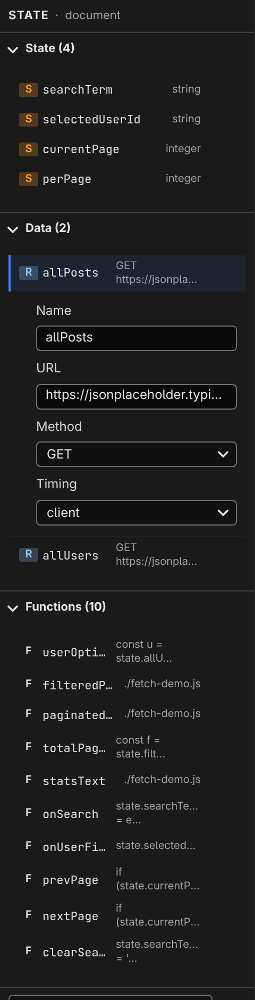

# Data sources

A data source is a state entry whose value comes from somewhere — a URL, the browser's storage, a form, your project's content, a database table — instead of being typed in. You add one from the **[State panel](/docs/studio/logic/state)**'s **+ Add…** picker, and from then on it behaves like any other value: bind it, compute from it, show it. Sources are reactive — when the underlying data changes, everything built on it updates. The model behind that is **[Reactivity](/docs/framework/concepts/reactivity)**.

Each source's editor shows just the fields that source needs.

## Request — fetch from a URL

**Fetch (Request)** loads data over HTTP — a JSON API, most typically.

- **URL** — where to fetch from.
- **Method** — `GET`, `POST`, `PUT`, `DELETE`, or `PATCH`.
- **Timing** — `client` fetches in the visitor's browser; `server` runs the request on the server instead — useful when an API can't be called from a browser.

While the request is in flight the entry reads as `pending` in the **[Data explorer](/docs/studio/logic/data-explorer)**; the resolved response then flows wherever the entry is used.

## LocalStorage and SessionStorage — remember in the browser

Both persist a value in the visitor's browser: **LocalStorage** survives closing the browser, **SessionStorage** lasts for the visit. Their editors are identical:

- **Key** — the name the value is stored under.
- **Default** — what the entry is worth before anything has been stored. JSON here gives you a structured default.

Writing to the entry (from an event handler, say) stores it; the visitor's next visit reads it back. Think "remember my theme choice", "keep the cart".

## Cookie — a value shared with the server

- **Cookie** — the cookie's name.
- **Default** — the value before the cookie exists.

Use a Cookie instead of LocalStorage when the server needs to see the value on each request.

## IndexedDB — a structured browser database

For larger structured data the browser stores locally:

- **Database** — the database name.
- **Store** — the object store within it.
- **Version** — the schema version number.

## FormData — the state of a form

**FormData** holds a browser form-data object — the shape requests use to submit forms:

- **Fields** — a JSON object naming the fields and their starting values.

The entry starts out seeded with those fields, ready to fill in and send as a request body.

## Set and Map

Two small structural sources round out the built-ins: **Set** (a list without duplicates) and **Map** (a keyed collection). Each has a single **Default** field, edited as JSON.

## ContentCollection — query your project's content

**ContentCollection** turns your project's content — the entries behind your **[content types](/docs/studio/projects/content-types)** — into a queryable list: "the six newest posts", "properties under $500k". It's provided by the parser extension, so it appears in the **+ Add…** picker via your project's imports. Its form is generated from the source's own description:

- **contentType** — which content type to query, picked from the ones your project defines.
- **filter** — zero or more rules, each a **field** (picked from the content type's own fields), an **op** (`==`, `!=`, `>`, `<`, `>=`, `<=`, `contains`, `not contains`, `empty`, `not empty`), and a **value**.
- **sort** — zero or more rules, each a **field** and an **order** (`asc` or `desc`).
- **limit** — the maximum number of entries to return.

On a page with a dynamic address, a field holding a reference shows a binding picker instead of a plain value — **Static value**, the page's URL parameters, or **Custom…** — so a detail page can query "the entry this URL names".

## Database sources

Everything above reads from the browser, the network, or your project's files. With the connector extension enabled, your **[data tables](/docs/studio/data)** join the picker too — the data that appears and changes while the site runs. Each of these sources starts with a **table**, the name of a table your project defines:

- **TableQuery** — the rows matching a query. **filter** and **sort** take the same rules as ContentCollection above, and **limit** and **offset** page through the results; **include** names reference fields to expand, so a query for posts can carry each post's author with it.
- **TableEntry** — a single row, named by **id**, with the same **include**. On a page with a dynamic address the id can bind to a URL parameter, which is how a detail page shows the row its URL names.
- **TableInsert**, **TableUpdate**, and **TableDelete** — writes rather than reads. Insert and update take **values**, literal columns merged over the fields of the form that submits them; update and delete take an **id**. Each resolves to a handler, so you point a form's submit event at one instead of displaying it — and once a write lands, the queries on the page refresh themselves.

## Account sources

The auth extension adds two more, both about who is looking at the page:

- **Session** — the signed-in visitor: a `userId`, their `role` if your project defines roles, and the user record. The whole entry is `null` when nobody is signed in — not an empty object — so test the entry itself before reaching into it for a `userId`. It updates live when someone signs in or out, and it is also always `null` on a page as it is generated: every prerendered page ships its signed-out view and fills in once the browser has checked. The one field, **baseUrl**, defaults to your own site's `/_jx/auth`.
- **AuthActions** — the handlers behind sign-up, sign-in, social sign-in, and sign-out, wired to a form's submit event like the table actions. **redirects** sets where a visitor lands after signing in or out, **provider** names the default social provider, and **baseUrl** is the same as above.

Both extensions are covered from the other side — the tables, the settings, the secrets — in **[Databases](/docs/studio/data)** and **[Auth and secrets](/docs/studio/data/auth-and-secrets)**.

## External sources

**External Module…** points an entry at a JavaScript module of your own (**Source** and **Prototype** fields); if the module describes its options, Studio renders them as a form, the same way it does for ContentCollection. Sources added by any other installed extension list themselves in the **+ Add…** picker the same way.

:::doc-note
Every source is stored as a small JSON object in the file's `state` — a `$prototype` naming the kind plus the fields above. Nothing here is code; the runtime interprets these declarations, as described in **[Reactivity](/docs/framework/concepts/reactivity)**. The table sources are rewritten at build time into ordinary fetches against `/_jx/data`, so no extension code ships to the browser.
:::

## Next

- Watch a source resolve, live, in the **[Data explorer](/docs/studio/logic/data-explorer)**
- Compute over fetched data with **[Formulas and expressions](/docs/studio/logic/formulas)**
- Content types themselves are managed in **[Content types](/docs/studio/projects/content-types)**
