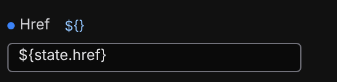
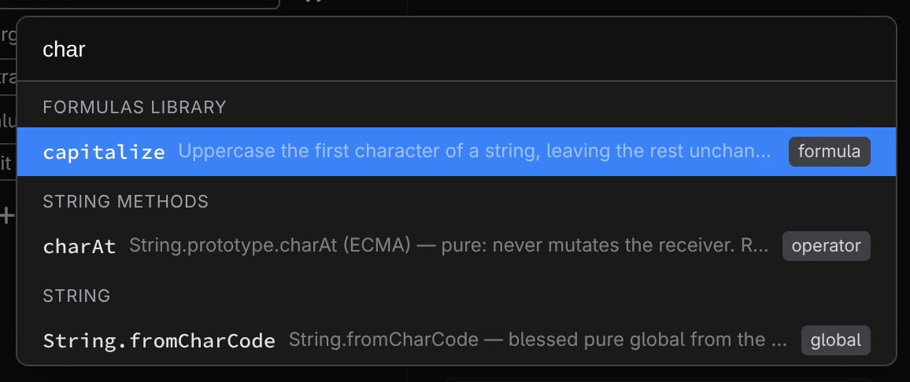

# Formulas and expressions

A formula is a value Studio calculates instead of one you type — a price times a quantity, a name in uppercase, a label that switches on a condition. Formulas aren't confined to one panel: nearly every value field in Studio can become one, and while you build it, Studio shows the live result computed from your page's real data.

## The field-mode button: any value can be dynamic

Bindable value rows in the **Properties** and **Style** tabs carry a small mode button beside their label. It shows the current mode's glyph — gray while the value is static, accent-colored once it's dynamic — and each click steps to the next mode, wrapping back around at the end:

- **abc** — a fixed value you type. The default.
- **$ref** — follow a state value: pick an entry from the **[State panel](/docs/studio/logic/state)** and the field always shows its current value.
- **${}** — a template mixing fixed text and values, like `Hello ${state.$name}`.
- **fx** — a full formula, edited right in the row.

Each position only offers the modes it supports (the button's tooltip names the mode a click will switch to), and Studio remembers what you had in each mode for the rest of your session — cycle away and back and your value is restored, not reset. Prefer the earliest mode that does the job — a `$ref` is easier to read (and to revisit) than a formula that only fetches one value.

Formulas also appear as their own state entries (_+ Add… > Expression_ in the State panel) and as event handlers (the **$expression** mode in the **[Events panel](/docs/studio/logic/events)**).

## The formula editor

A formula is a tree of small operations, and the editor edits one operation at a time:

- **Operator** — what this step does. The picker groups the whole vocabulary: assignment, arithmetic, comparison, logical, conditional, array methods, pure string/array/number methods, aggregates (`map`, `filter`, `reduce`), and `call` for invoking a named formula. The complete list, with what each operator means, is the **[operator reference](/docs/framework/reference/operators)**.
- **Target** and **Value** — the operands. Each one is a **lit** (a typed-in string, number, boolean, or null), a **$ref** (a state value), or an **expr** — a nested formula of its own, drawn indented beneath its parent.

Operators bring their own rows: the conditional shows **If** / **Then** / **Else**; `switch` shows an **On** row plus one row per case and a default, with **+ Add case** to grow it; `call` shows a **Callee** and one argument row per parameter.

## Chips and live value badges

Above the editor, the whole formula reads left to right as a strip of **chips** — the starting value first, then each operation applied to it, with nested branches shown as parenthesized groups. It's the "pipeline" view of the same tree: `$name › trim › toUpperCase`.

Next to chips and operands, green monospace **badges** show live values — each one is the actual result of that piece of the formula, evaluated against the running page's real data. The root's badge is the formula's final result, and if the formula can't evaluate, the error appears in red instead. Watching the badges while you edit is the fastest way to see where a formula goes wrong.

In the compact inline editor the chips are a summary; clicking them to navigate is what the **[formula workspace](/docs/studio/logic/formula-workspace)** is for.

## The formula palette

You don't have to assemble everything operator by operator. The brackets button beside the operator picker opens the **formula palette** — a search box over the whole catalog:

- Type to filter by name, group, or description; :kbd[↓] and :kbd[↑] move through results and :kbd[Enter] inserts the highlighted entry.
- **Formulas** lists the named formulas already defined in this file.
- **Formulas library** lists ready-made formulas that ship with Jx — `average`, `capitalize`, and friends. The full generated list is the **[formula catalog](/docs/framework/reference/formulas)**.
- The remaining groups are the operators themselves, plus the blessed standard-library functions (`Math.max`, `JSON.stringify`, …) callable from formulas.

Picking an entry replaces the current step with that operation, ready for you to fill in its operands.

:::doc-note
Library formulas are **copied in**, not linked: picking one writes its full definition into your file's state as a named formula, and the inserted step just calls it. Your project stays self-contained — there is no runtime dependency on the catalog, and you can open the copy in the State panel to inspect or edit it.
:::

## Named formulas

An **Expression** entry in the State panel is a formula with a name. Once it declares parameters, it becomes callable from any other formula via the `call` operator — the palette lists it under **Formulas**, and its argument rows are labeled with the parameter names. Library formulas arrive with their parameters declared; to add parameters to a formula of your own, edit its entry in **[Code mode](/docs/studio/logic/code)**. That's how you build a vocabulary: define `discountedPrice` once, call it everywhere.

## Next

- Give a big formula the whole canvas in the **[Formula workspace](/docs/studio/logic/formula-workspace)**
- Every operator, defined precisely: **[Operator reference](/docs/framework/reference/operators)**
- Every packaged formula: **[Formula catalog](/docs/framework/reference/formulas)**
