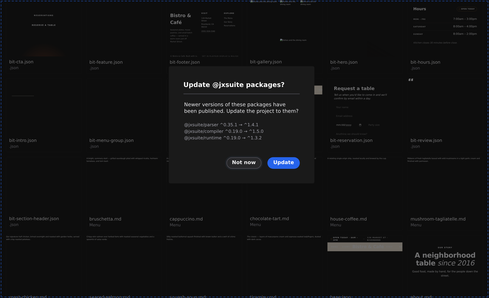
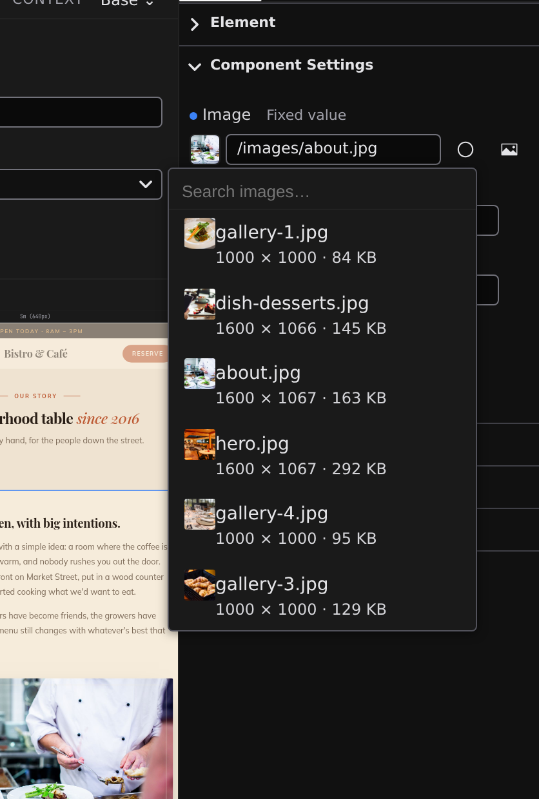

# Media

Your site's media — images, video, audio, PDFs, and fonts — lives in the project's `public/` folder, and the Manage view is where you put it there. Open Manage with the **Manage** button in the toolbar and click the **Media** filter to see every asset with a thumbnail.

## Upload files

1. Drag files from your computer anywhere onto the Manage view — or click **Upload** and pick them in the file dialog. You can drop several at once.
2. The new files appear in the **Media** section immediately, ready to use.

Studio accepts images (including SVG), video, audio, PDFs, and font files. Right-click any asset to **rename**, **duplicate**, or **delete** it. Renaming preselects just the name, so typing replaces `hero` in `hero.jpg` and leaves the extension alone.

:::doc-note
Uploads are written to your project's `public/` folder under their own name, and everything in `public/` is served from your site's root: `public/hero.jpg` becomes `/hero.jpg` on the published site. The folder layout is documented in [Site architecture](/docs/framework/site).
:::

## Pick media in a panel

Wherever Studio asks for an image or file — an image's **Properties**, a frontmatter field, the **Document** activity's icon and social-image fields — the same media picker appears: a thumbnail of the current file, a path field, and a browse button.

1. Click the browse (image) button beside the field.
2. A searchable list of your project's media opens, with a thumbnail beside each image. Type to filter.
3. Click a file to use it — Studio fills in its path for you.

You can also type into the path field directly, either a path from your project or a full web address.

## What the build does to images

You only ever upload one copy of an image, at full quality. When your site is built for publishing, each image is optimized automatically: the build generates multiple sizes and modern formats (WebP, AVIF) and wires them up so every visitor's browser downloads the smallest version that looks sharp on their screen. There is nothing to configure in Studio — the pipeline is described in **[Site architecture](/docs/framework/site)**.

## Next

- **[Browse your project](/docs/studio/projects/browse)** — the rest of the Manage view
- **[Publish](/docs/studio/publish)** — how the optimized site goes live
