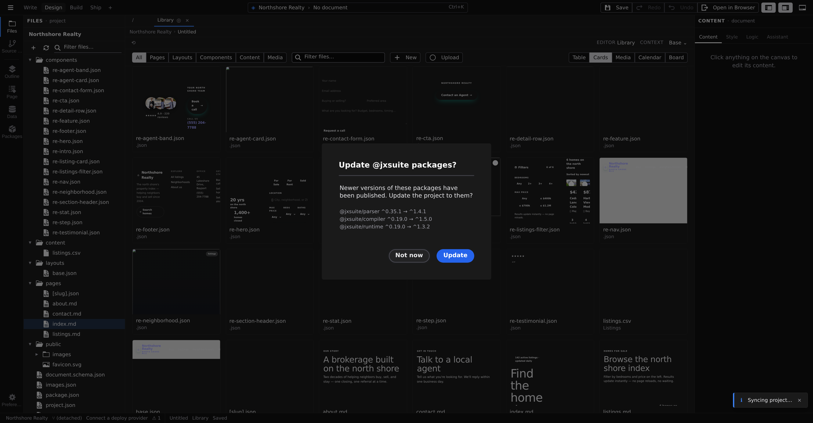

# Pages, layouts, and components

Everything you build in Studio is one of a few kinds of file. Knowing which is which — and when to reach for each — is most of what there is to learn about structuring a Jx site.

## Pages

A page is one address on your site. Each file in your project's `pages/` folder becomes one URL: the file named `index` is your home page, `about` becomes `/about`, and a file inside a `blog/` subfolder becomes `/blog/…`. Add a page and you've added a place visitors can go; delete it and the address is gone.

Routing details — dynamic addresses, catch-alls — live in **[Site architecture](/docs/framework/site)**.

## Layouts

A layout is the shared frame around your pages: the header, footer, and everything else that repeats on every page of a section. Layouts live in the `layouts/` folder, and each page picks the layout that wraps it — so changing the header in one layout changes it on every page that uses it.

Reach for a layout when you catch yourself rebuilding the same surroundings on a second page.

## Components

A component is a reusable building block — a card, a hero section, a testimonial, a navigation bar. Components live in the `components/` folder and can be placed on any page or layout, as many times as you like. Edit the component once and every place it appears updates.

Reach for a component when the same element shows up more than once, or when a page is getting big enough that you want to name its parts. The underlying idea is documented in **[Components](/docs/framework/concepts/components)**.

## Create one

All three are created the same way, from the [Manage view](/docs/studio/projects/browse):

1. Click **Manage** in the toolbar.
2. Click **New** and choose **Page**, **Layout**, or **Component**. (The menu also lists your project's content types — see [Browse your project](/docs/studio/projects/browse).)
3. Type a name in the dialog and click **Create**. Studio turns it into a file name (`About Us` becomes `about-us`), writes the file into the matching folder, and opens it in a tab, ready to edit.

:::doc-note
Studio writes each new file into `pages/`, `layouts/`, or `components/` in your project folder — plain files you can rename, duplicate, or delete from Manage's right-click menu.
:::

## Which one do I want?

- **A destination** people should be able to visit → a **page**.
- **The frame** that repeats around many pages → a **layout**.
- **An element** that repeats within pages → a **component**.

When in doubt, start with a page. You can always select part of it later and grow that part into a component once it earns reuse.

## Next

- **[Design mode](/docs/studio/design)** — style what you just created on the live canvas
- **[Edit mode](/docs/studio/editing)** — write content inline
- **[Site architecture](/docs/framework/site)** — the folder-by-folder anatomy underneath
