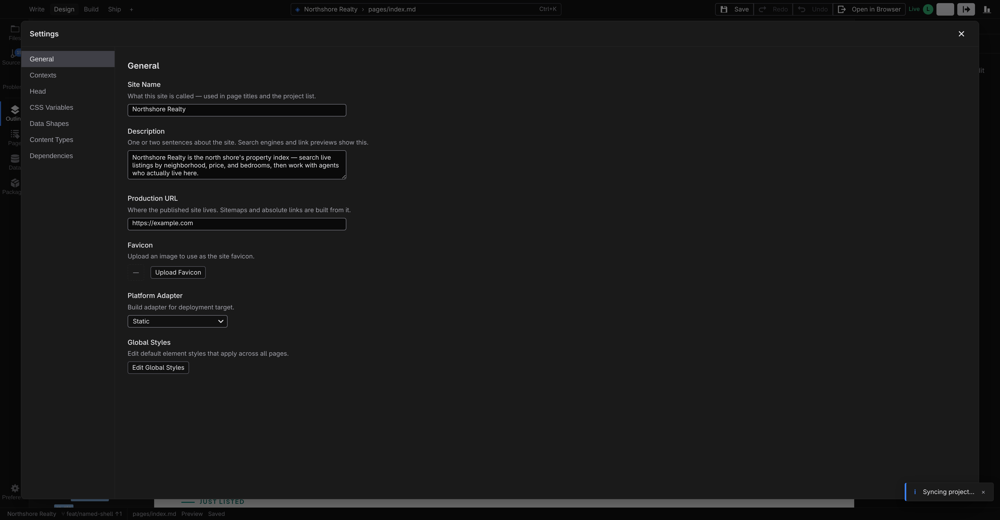

# Project settings

The Settings modal holds everything that applies to your whole site rather than one page — the favicon, fonts, design tokens, and dependencies. Open it with the **Settings** gear at the bottom of the activity bar; a navigation list on the left switches between sections.

Changes save as you make them — there is no separate save button. If a save can't be written, the section says so under the field you were editing rather than quietly reverting it.

## General

The basics of the site:

- **Site Name** — what the site is called. This is the name you gave it when [creating the project](/docs/studio/projects/create), and this is where you change it afterwards. It can't be left blank.
- **Description** — one or two sentences about the site, used by search engines and link previews. Studio stores it as the site-wide `<meta name="description">` tag, so it also shows up in the **Head** section; clearing it here removes the tag.
- **Production URL** — where the published site lives, as a full address starting with `http://` or `https://`. Sitemap generation is switched on by having one, and absolute links are built from it. Clearing the field turns the sitemap back off.
- **Favicon** — click **Upload Favicon** and pick an image; Studio copies it into your project and shows the current one beside the button.
- **Platform Adapter** — how the build packages the site for your host: **Static**, **Bun**, **Node**, **Cloudflare Workers**, or **Cloudflare Pages**. This is where the choice is made; [creating a project](/docs/studio/projects/create) doesn't ask. **Static** emits plain files for any host that serves them; the other four additionally package the site's server tier, which is what answers a database, sign-ins, or server functions. One of them becomes _required_ once the project has a database or sign-ins — the build stops with an error on **Static**. Server functions still build on **Static**, but only these four actually serve them. See [Build output and adapters](/docs/framework/site/deployment) for what each one writes into `dist/`.
- **Global Styles** — a shortcut that opens the project file where site-wide default styles live.

## Contexts

The conditions your pages are rendered under — and the only place they are defined. Breakpoints used to be a field in **General**; they now sit here beside the two other things that share the same `$media` map on disk.

- **Base width** — how wide the Base canvas renders when no other context applies.
- **Size breakpoints** — width conditions like `(max-width: 768px)`. Each one gets its own canvas panel in Design view. See **[Breakpoints](/docs/studio/design/breakpoints)**.
- **Colour schemes** — a Light/Dark picker that writes the `prefers-color-scheme` query for you. Declaring one turns on the **Auto / Light / Dark** control in the context bar.
- **Feature queries** — anything else a media query can ask: reduced motion, print, hover, orientation. These become toggles in the context bar rather than canvas panels.

Name a context in plain language; Studio derives the stored name ("Wide screen" becomes `--wide-screen`). Each change is schema-checked before it is written, and a refusal — a duplicate name, an empty query, a `project.json` write that fails — appears under the control that caused it while the old value stays put.

The context bar's **Context** popover only _chooses_ among what is defined here; its **Manage contexts…** footer opens this section, so you can add a breakpoint without losing your element selection.

## Head

What goes into every page's `<head>` — the invisible part of a web page that loads fonts, styles, and services:

- **Google Fonts** — type a font family name and click **+ Add** to load it across the whole site. Loaded fonts are listed with a delete button each.
- **Head tags** — add a **Link** (external stylesheet), **Meta** (page metadata), **Script**, or **Style** entry and fill in its fields. Script and Style entries get a text box for their body — this is where an analytics snippet or a custom style block goes.

## CSS Variables

Your design tokens — the named colors, fonts, and sizes your styles refer to, grouped into **Colors** (each with a color swatch you can click to pick), **Fonts** (each with a live preview line), **Sizes & Spacing**, and **Other**. Edit a value and every element that uses the token updates; sizes can also carry per-breakpoint overrides so spacing tightens on small screens.

## Data Shapes

Reusable descriptions of a piece of data — an API response, a shared record type — that other parts of the project can refer to. Data shapes use the same visual field builder as content types: named fields with a type, an optional format, and a required toggle. **New Data Shape** adds one; pick a shape on the left to edit its fields. Most sites never need this section; for modeling your content itself, use **[Content types](/docs/studio/projects/content-types)** instead.

## Dependencies

The npm packages your project uses, as a table of name, current version, and the latest available version:

- Type a package name and click **Add** to install one.
- A refresh icon appears on any row with an update available; **Update all** takes every row to its latest at once.
- **Reinstall** re-installs everything from scratch — the fix-it button if packages ever end up in a bad state.

Adding packages and choosing which of their components your site uses is covered in **[Dependencies and imports](/docs/studio/projects/dependencies)**.

## Sections added by extensions

Extensions can contribute their own settings sections, which appear in the same list. **Content Types** — the section where you model your site's content — arrives this way, and has its own page: **[Content types](/docs/studio/projects/content-types)**.

:::doc-note
Every section of this modal edits `project.json` at the root of your project — the same file the New Project modal first wrote. The full shape is documented in [Site architecture](/docs/framework/site).
:::

## Next

- **[Content types](/docs/studio/projects/content-types)** — model your content in the Content Types section
- **[Dependencies and imports](/docs/studio/projects/dependencies)** — packages and component imports in depth
