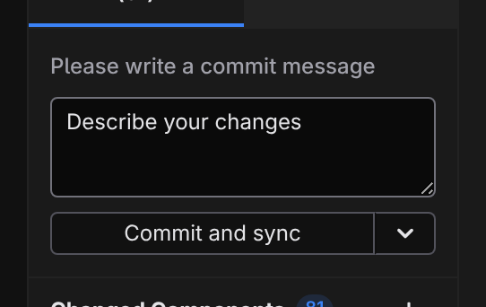

# Publish

Shipping a Jx site is part of the Studio flow — no terminal, no separate deploy tool. The one boundary worth knowing up front: **Studio publishes your code — it doesn't build or deploy the site.** Studio's job ends when your files reach your repository; your host takes it from there.

## How it goes live

1. In the **Source Control** panel, you write a message and **Commit and sync** — Studio records the change and pushes it to your repository.
2. The push wakes your host (or CI), which builds the project into plain HTML, CSS, and a little JavaScript.
3. The host serves that output from a CDN. Your site is live.

The **deployment adapter** — Static, Bun, Node, Cloudflare Workers, or Cloudflare Pages — tells the build how to package the output for your target. It isn't a creation-time decision: set it in [Project settings](/docs/studio/projects/settings) whenever you know where the site is going. Switching hosts means switching the adapter; your pages, components, and content stay the same.

Every page is built ahead of time, so what the CDN serves is finished HTML however the site is put together. Pick one of the non-Static adapters and the same build writes a small worker beside those files for your host to run — that is what answers the `/_jx/*` routes behind a database, sign-ins, or server functions. A database or sign-ins make an adapter mandatory: the build stops with an error on **Static**. Server functions still build there, but nothing serves them without an adapter. **[Build output and adapters](/docs/framework/site/deployment)** lists what each adapter emits.

Because every Jx file is plain JSON or Markdown, each publish is a clean, reviewable set of changes — no binary blobs, no database dumps.

## The two surfaces

- **[Source control](/docs/studio/publish/source-control)** — the built-in git client: review and stage changes, commit and sync, branches, pulling, and history.
- **[GitHub](/docs/studio/publish/github)** — connect your GitHub account and publish a brand-new project as a repository in one flow.

## Next

- Understand the build and routing in **[Site architecture](/docs/framework/site)**
