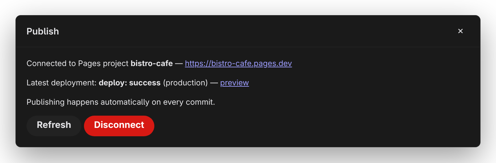

# Publish to Cloudflare Pages

The Publish panel connects your project to Cloudflare Pages — a free static-site host — so that every commit you sync builds and publishes automatically. Open it with the **Publish** button in the toolbar.

Before you start, the project needs to live on GitHub — if it doesn't yet, **[GitHub](/docs/studio/publish/github)** walks you through publishing it from Studio.

## Connect your Cloudflare account

The first time you open the panel, it asks for a Cloudflare connection. What you see depends on your Studio platform:

- **Connect Cloudflare** — click it and sign in to Cloudflare in the window that opens. Done.
- **API token form** — some platforms ask you to paste a Cloudflare API token instead (create one in the Cloudflare dashboard with the permissions the panel names: Account Settings Read, Pages Read/Write), then click **Verify & Connect**. The token stays on your machine.

If the panel instead says it can't reach the Cloudflare API on this platform, you don't need it at all — set up Pages once in Cloudflare's own dashboard and publishing still works the same way: commit and sync, your host builds.

## Create and connect a Pages project

Once connected, the panel offers to create a Pages project tied to your repository:

1. **Account** — pick your Cloudflare account.
2. **Pages project name** — pre-filled from your project's name; this becomes part of your free site address.
3. **GitHub owner** and **GitHub repository** — where the project lives.
4. **Production branch** — the branch that publishes to your live site, normally `main`.
5. Click **Create & Connect**.

Studio creates the Pages project (or reuses one with that name if it already exists) and configures it to build and publish your site on every push. If Cloudflare reports it can't see the repository, the error includes a link to install the **Cloudflare Pages** GitHub App — install it on the repository and try again.

## Watch deployments

After connecting, the panel becomes a status view:

- The connected Pages project's name, with a link to your live site address.
- The latest deployment's stage and status — for example _deploy: success_ — with a **preview** link to that exact build.
- **Refresh** re-checks; **Disconnect** removes the connection (your Pages project and site stay up — only the link from Studio is removed).

There is no publish button, because publishing is automatic: every **Commit and sync** in **[Source control](/docs/studio/publish/source-control)** triggers a fresh build and deployment. Right after connecting, the panel shows _No deployments yet_ — your next commit starts the first one.

:::doc-note
Studio records the connection under `build.deploy` in `project.json` — provider, account, project name, and live address — so it travels with the repository, and any copy of Studio that opens the project knows publishing is already set up. Cloudflare builds with `bunx jx build` and serves the `dist/` output.
:::

## Next

- **[Source control](/docs/studio/publish/source-control)** — the commit-and-sync flow that triggers each deployment
- **[Other hosts](/docs/studio/publish/other-hosts)** — the same site on Netlify, GitHub Pages, or anywhere else
