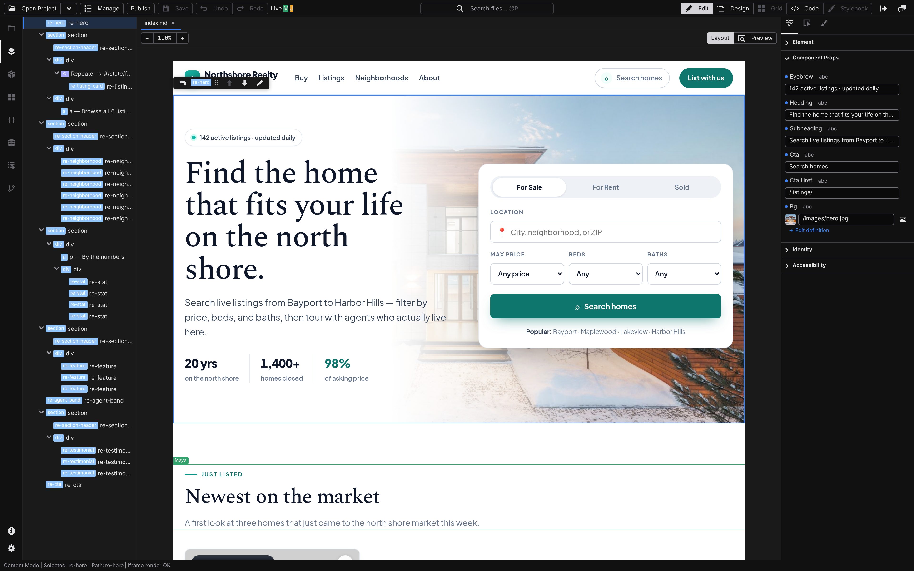

# Real-time collaboration

When two people open the same file through the same Studio backend, the tab becomes a shared session: everyone sees everyone's edits as they happen, on the canvas and in the code. There's nothing to turn on — if your setup supports it (see below), co-editing starts by itself the moment a second person opens the file, and a file opened alone behaves exactly as always.

## What you see

- **A status pill** in the toolbar — **Live** while the session is connected. It replaces the usual unsaved-changes dot for this tab.
- **Presence chips** — one colored circle per collaborator, showing their avatar or initial. Hover one to see who it is and which file they're in; peers elsewhere in the project show up too, labeled with the file they're browsing.
- **Selections on the canvas** — each peer's selected element is outlined in their color, labeled with their name, and follows them live.
- **Cursors in Code view** — in the **[Code](/docs/studio/logic/code)** mode the shared text carries every writer's caret and selection in their color, with their name on the caret.

## How co-editing behaves

- **Edits merge.** Everyone edits the same live document — changes apply as they arrive, and simultaneous edits to different parts of a file both land. No locking, no taking turns.
- **Undo is yours alone.** :kbd[⌘Z] / :kbd[Ctrl+Z] steps back through _your_ edits only — you can't undo what a teammate just did.
- **Forms sync too.** Page metadata and frontmatter fields co-edit the same way the canvas does.
- **Code view takes precedence.** While someone is editing the file as text, the text is the truth: structural editing pauses for everyone else ("Source editing in progress — structural edits are paused"), and the canvas previews the text edits live. When the last text editor leaves Code view, normal editing resumes.
- **Read-only guests follow along.** On backends that grant view-only access, those visitors see everything — content, cursors, presence — but their edits are not accepted.

## Syncing is not saving

Your edits reach your collaborators instantly, but the file on disk still changes only when someone saves — the explicit **Save** is unchanged. What _is_ shared is the unsaved state itself: the moment anyone edits, the file counts as unsaved for the whole session, and one person saving saves the shared result for everyone. Committing in **[Source control](/docs/studio/publish/source-control)** saves open co-edited files first, so a commit always captures what the session currently sees.

:::doc-warning
On a shared dev server, unsaved co-edits live only in the server's memory. If everyone closes the file without saving, those edits are discarded shortly after — save before you all walk away.
:::

## Which setups support it

- **A shared dev server** — the built-in case. Everyone who opens the same dev-server URL (see **[The dev server](/docs/framework/build/dev-server)**) co-edits; even two browser windows on your own machine will. The dev server has no user accounts, so collaborators appear with generic names (`local-1`, `local-2`, …) and everyone can write.
- **A hosted Studio backend** — cloud backends that offer a collaboration endpoint get the same experience, with real identities (name and avatar) and per-person write or read-only permission supplied by the platform.
- **The [desktop app](/docs/studio/desktop)** — always solo: it edits your local files directly and has no collaboration endpoint.

## Falling back to solo

Collaboration degrades, never blocks:

- A backend without the endpoint simply gives you ordinary solo editing — no errors, no pill.
- If a session can't sync within a few seconds of opening, the tab proceeds solo.
- If the connection drops, the pill reads **Offline — changes sync on reconnect**: keep editing, and your changes merge when the connection returns.
- If the file is replaced underneath the session — a git pull or discard, an outside edit — the session resets and rejoins on the new content automatically.

## Next

- **[Source control](/docs/studio/publish/source-control)** — turn the shared result into a commit
- **[Code](/docs/studio/logic/code)** — the text view that co-editing shares character by character
