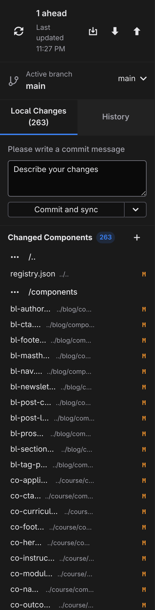

# Source control

Source Control is Studio's built-in git client — a sidebar panel that records your work as commits and keeps your copy of the project in sync with its repository. Open it by clicking **Source Control** (the branch icon) in the activity bar; a badge on the icon shows how many files have changed.

If the project isn't under version control yet, the panel offers **Initialize Repository** to start tracking it locally, and **Publish to GitHub** to go straight to a hosted repository — see **[GitHub](/docs/studio/publish/github)**.

## Review your changes

The **Local Changes** tab lists every changed file, grouped by the part of the project it belongs to. Each row shows the file's name and a status badge — **M** for modified, **A** for added, **U** for a brand-new untracked file.

- Click a changed file to open a diff in the canvas — what changed since your last commit.
- Click **+** on a row to stage it (mark it for the next commit), or the header's stage-all button to stage everything. Staged files move to a **Staged Changes** section, where **−** unstages them.
- Click the undo icon on a row to discard its changes. Studio asks for confirmation first.

:::doc-warning
**Discard** permanently throws away a file's changes since the last commit — there is no undo beyond the confirmation dialog.
:::

## Commit and sync

1. Type a summary of your work in the message box.
2. Click **Commit and sync** — Studio records the commit and pushes it to your repository in one step. That push is what triggers your host's build, as described in **[Publish](/docs/studio/publish)**.

To record a commit without pushing, open the dropdown beside the button and choose **Commit (don't sync)**, or press :kbd[Ctrl+Enter] in the message box. If nothing is staged, the commit takes all changed files.

## Stay in sync

The bar at the top of the panel shows where you stand against the repository — **Up to date**, or how many commits you are ahead or behind — with a last-updated time. Studio refreshes this automatically while the panel is open. Three buttons act on it:

- **Fetch** — check the repository for news without changing your files.
- **Pull** — bring teammates' commits into your copy.
- **Push** — send your local commits up.

Studio also pulls automatically when you open a project that has a remote, so a session starts from the current state. If a pull can't merge cleanly, Studio reports the error and changes nothing — with one exception: conflicts caused purely by Studio's own automated package updates are resolved for you (Studio discards its own machine-generated edits, pulls, and re-applies them; if _you_ edited those files it asks before discarding anything).

A project with no remote yet shows **Local only (no remote)** here, with a **Publish to GitHub** shortcut.

## Branches

The **Active branch** row shows which branch you're on. Use its picker to switch to another branch, or choose **+ New branch…** — Studio opens a **New Branch** dialog; type a name and click **Create**. Branches let you try a redesign on the side and only merge it when it's ready.

## History

The **History** tab lists your project's recent commits — message, author, and when — so you can see how the site got to where it is.

## Next

- **[GitHub](/docs/studio/publish/github)** — put a local project on GitHub without leaving Studio
- **[Publish](/docs/studio/publish)** — how a push becomes a live site
